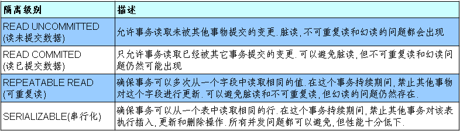

# 一、JDBC概述

Java Database Connectivity 服务端操作数据库的接口。

## 1.1体系结构


## 1.2编写步骤


# 二、连接数据库

## 2.1过程

``` java
@Test
public  void testConnection5() throws Exception {
    //1.加载配置文件
    InputStream is = ConnectionTest.class.getClassLoader().getResourceAsStream("jdbc.properties");
    Properties pros = new Properties();
    pros.load(is);
    
    //2.读取配置信息
    String user = pros.getProperty("user");
    String password = pros.getProperty("password");
    String url = pros.getProperty("url");
    String driverClass = pros.getProperty("driverClass");

    //3.加载驱动
    Class.forName(driverClass);

    //Driver driver = (Driver) clazz.newInstance();

    //3.1 注册驱动
    //DriverManager.registerDriver(driver);
    /*
    可以注释掉上述代码的原因，是因为在mysql的Driver类中声明有：
    static {
        try {
            DriverManager.registerDriver(new Driver());
        } catch (SQLException var1) {
            throw new RuntimeException("Can't register driver!");
        }
    }

    */

    //4.获取连接
    Connection conn = DriverManager.getConnection(url,user,password);
    System.out.println(conn);

}
```

# 三、实现CRUD操作

在 java.sql 包中有 3 个接口分别定义了对数据库的调用的不同方式：

* Statement：用于执行静态 SQL 语句并返回它所生成结果的对象。
  
* PrepatedStatement：SQL 语句被预编译并存储在此对象中，可以使用此对象多次高效地执行该语句。
  
* CallableStatement：用于执行 SQL 存储过程


由于Statemen存在SQL注入的问题所以使用PreparedStatement

## 3.1使用PreparedStatement

SQL语句中的参数用" ? "表示

### 3.1.1增删改

``` java
//通用的增、删、改操作（体现一：增、删、改 ； 体现二：针对于不同的表）
public void update(String sql,Object ... args){
    Connection conn = null;
    PreparedStatement ps = null;
    try {
        //1.获取数据库的连接
        conn = JDBCUtils.getConnection();
        
        //2.获取PreparedStatement的实例 (或：预编译sql语句)
        ps = conn.prepareStatement(sql);
        //3.填充占位符
        for(int i = 0;i < args.length;i++){
            ps.setObject(i + 1, args[i]);
        }
        
        //4.执行sql语句
        ps.execute();
    } catch (Exception e) {
        
        e.printStackTrace();
    }finally{
        //5.关闭资源
        JDBCUtils.closeResource(conn, ps);
        
    }
}
```

### 3.1.2查

``` java
// 通用的针对于不同表的查询:返回一个对象 (version 1.0)
public <T> T getInstance(Class<T> clazz, String sql, Object... args) {

    Connection conn = null;
    PreparedStatement ps = null;
    ResultSet rs = null;
    try {
        // 1.获取数据库连接
        conn = JDBCUtils.getConnection();

        // 2.预编译sql语句，得到PreparedStatement对象
        ps = conn.prepareStatement(sql);

        // 3.填充占位符
        for (int i = 0; i < args.length; i++) {
            ps.setObject(i + 1, args[i]);
        }

        // 4.执行executeQuery(),得到结果集：ResultSet
        rs = ps.executeQuery();

        // 5.得到结果集的元数据：ResultSetMetaData
        ResultSetMetaData rsmd = rs.getMetaData();

        // 6.1通过ResultSetMetaData得到columnCount,columnLabel；通过ResultSet得到列值
        int columnCount = rsmd.getColumnCount();
        if (rs.next()) {
            T t = clazz.newInstance();
            for (int i = 0; i < columnCount; i++) {// 遍历每一个列

                // 获取列值
                Object columnVal = rs.getObject(i + 1);
                // 获取列的别名:列的别名，使用类的属性名充当
                String columnLabel = rsmd.getColumnLabel(i + 1);
                // 6.2使用反射，给对象的相应属性赋值
                Field field = clazz.getDeclaredField(columnLabel);
                field.setAccessible(true);
                field.set(t, columnVal);

            }

            return t;

        }
    } catch (Exception e) {

        e.printStackTrace();
    } finally {
        // 7.关闭资源
        JDBCUtils.closeResource(conn, ps, rs);
    }

    return null;

}
```

**ORM思想：**


# 四、操作BLOB类型字段

## 4.1 MySQL BLOB

BLOB类型：二进制大数据。


## 4.2插入

ps.setBlob(?,FileInputStream);

## 4.3查询


首先从数据库中读取：Blob photo = rs.getBlob(5);

然后用流读取：

``` java
InputStream is = photo.getBinaryStream();
OutputStream os = new FileOutputStream("c.jpg");
byte [] buffer = new byte[1024];
int len = 0;
while((len = is.read(buffer)) != -1){
  os.write(buffer, 0, len);
}
```

# 五、批量插入

## 5.1批量执行SQL语句

可以采用java的批量更新机制

主要是以下三个方法：

* addBatch(String)：添加需要批量处理的SQL语句或是参数；

* executeBatch()：执行批量处理语句；

* clearBatch():清空缓存的数据

``` java
/* 使用 addBatch() / executeBatch() / clearBatch()
 * mysql服务器默认是关闭批处理的，我们需要通过一个参数，让mysql开启批处理的支持。?rewriteBatchedStatements=true 写在配置文件的url后面
 * 使用更新的mysql 驱动：mysql-connector-java-5.1.37-bin.jar
 */
@Test
public void testInsert2() throws Exception{
    long start = System.currentTimeMillis();
        
    Connection conn = JDBCUtils.getConnection();
        
    //1.设置为不自动提交数据
    conn.setAutoCommit(false);
        
    String sql = "insert into goods(name)values(?)";
    PreparedStatement ps = conn.prepareStatement(sql);
        
    for(int i = 1;i <= 1000000;i++){
        ps.setString(1, "name_" + i);
            
        //1.“攒”sql
        ps.addBatch();
            
        if(i % 500 == 0){
            //2.执行
            ps.executeBatch();
            //3.清空
            ps.clearBatch();
        }
    }
        
    //2.提交数据
    conn.commit();
        
    long end = System.currentTimeMillis();
    System.out.println("花费的时间为：" + (end start));//1000000条:4978 
        
    JDBCUtils.closeResource(conn, ps);
}
```
# 六、数据库事务

## 6.1介绍

是一组操作数据的动作。

提交失败就回滚。

## 6.2JDBC事务处理

自动提交
* DDL操作一旦执行自动提交
* DML默认提交可以通过set autocommit = false方式取消
* 关闭连接时自动提交。

让多个SQL语句作为一个事务执行：
* 调用 Connection 对象的 setAutoCommit(false); 以取消自动提交事务
* 在所有的 SQL 语句都成功执行后，调用 commit(); 方法提交事务
* 在出现异常时，调用 rollback(); 方法回滚事务

## 6.3事务的ACID属性

* 一致性：事务必须使数据库从一个一致性状态变换到另外一个一致性状态。
* 持久性：一个事务一旦被提交，它对数据库中数据的改变就是永久性的，接下来的其他操作和数据库故障不应该对其有任何影响。
* 原子性：事务是一个不可分割的工作单位，事务中的操作要么都发生，要么都不发生。
* 隔离性：一个事务的执行不能被其他事务干扰，即一个事务内部的操作及使用的数据对并发的其他事务是隔离的，并发执行的各个事务之间不能互相干扰。

### 6.3.1并发问题

脏读、不可重复读、幻读

隔离级别越高, 数据一致性就越好, 但并发性越弱。

### 6.3.2四种隔离级别



### 6.3.3MySQL中设置隔离级别

一般设置为RED_COMMITTED

数据库连接都有一个全局变量 @@tx_isolation, 表示当前的事务隔离级别。

查看当前的隔离级别: 

```mysql
SELECT @@tx_isolation;RED_COMMITTED
```

设置当前 mySQL 连接的隔离级别:  

```mysql
set  transaction isolation level read committed;
```

设置数据库系统的全局的隔离级别:

```mysql
set global transaction isolation level read committed;
```

补充操作：

创建mysql数据库用户：

```mysql
create user tom identified by 'abc123';
```

授予权限

```mysql
#授予通过网络方式登录的tom用户，对所有库所有表的全部权限，密码设为abc123.
grant all privileges on *.* to tom@'%'  identified by 'abc123'; 

#给tom用户使用本地命令行方式，授予atguigudb这个库下的所有表的插删改查的权限。
grant select,insert,delete,update on atguigudb.* to tom@localhost identified by 'abc123'; 

```

Java代码设置隔离级别：

``` java
connection.setTransactionIsolation(Connection.TRANSACTION_隔离级别);
```

# 七、DAO

DAO：Data Access Object访问数据信息的类和接口，包括了对数据的CRUD（Create、Retrival、Update、Delete），而不包含任何业务相关的信息。有时也称作：BaseDAO

作用：为了实现功能的模块化，更有利于代码的维护和升级。

# 八、数据库连接池

传统开不断地建立，断开连接造成资源浪费；出错会导致内存泄漏；不能控制被创建的连接数。

**数据库连接池的基本思想**：就是为数据库连接建立一个“缓冲池”。预先在缓冲池中放入一定数量的连接，当需要建立数据库连接时，只需从“缓冲池”中取出一个，使用完毕之后再放回去。

数据库连接的数量是由最小数据库连接数来设定的。无论这些数据库连接是否被使用，连接池都将一直保证至少拥有这么多的连接数量。连接池的最大数据库连接数量限定了这个连接池能占有的最大连接数，当应用程序向连接池请求的连接数超过最大连接数量时，这些请求将被加入到等待队列中。

**优点：**
1. 资源重用
2. 更快的系统反应速度
3. 新的资源分配手段
4. 统一连接管理，避免连接泄露

## 8.1多钟开源的的连接池

JDBC 的数据库连接池使用 javax.sql.DataSource 来表示，DataSource 只是一个接口，该接口通常由服务器(Weblogic, WebSphere, Tomcat)提供实现，也有一些开源组织提供实现：
* **DBCP** 是Apache提供的数据库连接池。tomcat 服务器自带dbcp数据库连接池。速度相对c3p0较快，但因自身存在BUG，Hibernate3已不再提供支持。
* **C3P0** 是一个开源组织提供的一个数据库连接池，速度相对较慢，稳定性还可以。hibernate官方推荐使用
* **Proxool** 是sourceforge下的一个开源项目数据库连接池，有监控连接池状态的功能，稳定性较c3p0差一点
* **BoneCP** 是一个开源组织提供的数据库连接池，速度快
* **Druid(主要使用)** 是阿里提供的数据库连接池，据说是集DBCP 、C3P0 、Proxool 优点于一身的数据库连接池，但是速度不确定是否有BoneCP快

### 8.1.1Druid(德鲁伊)数据库连接池

连接：

``` java
package com.atguigu.druid;

import java.sql.Connection;
import java.util.Properties;

import javax.sql.DataSource;

import com.alibaba.druid.pool.DruidDataSourceFactory;

public class TestDruid {
    public static void main(String[] args) throws Exception {
        Properties pro = new Properties();		 
        pro.load(TestDruid.class.getClassLoader().getResourceAsStream("druid.properties"));
        DataSource ds = DruidDataSourceFactory.createDataSource(pro);
        Connection conn = ds.getConnection();
        System.out.println(conn);
    }
}
```

druid.properties配置文件

``` java
url=jdbc:mysql://localhost:3306/test?rewriteBatchedStatements=true
username=root
password=123456
driverClassName=com.mysql.jdbc.Driver

initialSize=10
maxActive=20
maxWait=1000
filters=wall
```

详细配置参数：

| **配置**                      | **缺省** | **说明**                                                     |
| ----------------------------- | -------- | ------------------------------------------------------------ |
| name                          |          | 配置这个属性的意义在于，如果存在多个数据源，监控的时候可以通过名字来区分开来。   如果没有配置，将会生成一个名字，格式是：”DataSource-” +   System.identityHashCode(this) |
| url                           |          | 连接数据库的url，不同数据库不一样。例如：mysql :   jdbc:mysql://10.20.153.104:3306/druid2      oracle :   jdbc:oracle:thin:@10.20.149.85:1521:ocnauto |
| username                      |          | 连接数据库的用户名                                           |
| password                      |          | 连接数据库的密码。如果你不希望密码直接写在配置文件中，可以使用ConfigFilter。详细看这里：<https://github.com/alibaba/druid/wiki/%E4%BD%BF%E7%94%A8ConfigFilter> |
| driverClassName               |          | 根据url自动识别   这一项可配可不配，如果不配置druid会根据url自动识别dbType，然后选择相应的driverClassName(建议配置下) |
| initialSize                   | 0        | 初始化时建立物理连接的个数。初始化发生在显示调用init方法，或者第一次getConnection时 |
| maxActive                     | 8        | 最大连接池数量                                               |
| maxIdle                       | 8        | 已经不再使用，配置了也没效果                                 |
| minIdle                       |          | 最小连接池数量                                               |
| maxWait                       |          | 获取连接时最大等待时间，单位毫秒。配置了maxWait之后，缺省启用公平锁，并发效率会有所下降，如果需要可以通过配置useUnfairLock属性为true使用非公平锁。 |
| poolPreparedStatements        | false    | 是否缓存preparedStatement，也就是PSCache。PSCache对支持游标的数据库性能提升巨大，比如说oracle。在mysql下建议关闭。 |
| maxOpenPreparedStatements     | -1       | 要启用PSCache，必须配置大于0，当大于0时，poolPreparedStatements自动触发修改为true。在Druid中，不会存在Oracle下PSCache占用内存过多的问题，可以把这个数值配置大一些，比如说100 |
| validationQuery               |          | 用来检测连接是否有效的sql，要求是一个查询语句。如果validationQuery为null，testOnBorrow、testOnReturn、testWhileIdle都不会其作用。 |
| testOnBorrow                  | true     | 申请连接时执行validationQuery检测连接是否有效，做了这个配置会降低性能。 |
| testOnReturn                  | false    | 归还连接时执行validationQuery检测连接是否有效，做了这个配置会降低性能 |
| testWhileIdle                 | false    | 建议配置为true，不影响性能，并且保证安全性。申请连接的时候检测，如果空闲时间大于timeBetweenEvictionRunsMillis，执行validationQuery检测连接是否有效。 |
| timeBetweenEvictionRunsMillis |          | 有两个含义： 1)Destroy线程会检测连接的间隔时间2)testWhileIdle的判断依据，详细看testWhileIdle属性的说明 |
| numTestsPerEvictionRun        |          | 不再使用，一个DruidDataSource只支持一个EvictionRun           |
| minEvictableIdleTimeMillis    |          |                                                              |
| connectionInitSqls            |          | 物理连接初始化的时候执行的sql                                |
| exceptionSorter               |          | 根据dbType自动识别   当数据库抛出一些不可恢复的异常时，抛弃连接 |
| filters                       |          | 属性类型是字符串，通过别名的方式配置扩展插件，常用的插件有：   监控统计用的filter:stat日志用的filter:log4j防御sql注入的filter:wall |
| proxyFilters                  |          | 类型是List，如果同时配置了filters和proxyFilters，是组合关系，并非替换关系 |

# 九、Apache-DBUtils实现CRUD操作

是 Apache 组织提供的一个开源 JDBC工具类库

## 9.1 DbUtils

提供如关闭连接、装载JDBC驱动程序等常规工作的工具类，里面的所有方法都是静态的。主要方法如下：

- **public static void close(…) throws java.sql.SQLException**：　DbUtils类提供了三个重载的关闭方法。这些方法检查所提供的参数是不是NULL，如果不是的话，它们就关闭Connection、Statement和ResultSet。
- public static void closeQuietly(…): 这一类方法不仅能在Connection、Statement和ResultSet为NULL情况下避免关闭，还能隐藏一些在程序中抛出的SQLEeception。
- public static void commitAndClose(Connection conn)throws SQLException： 用来提交连接的事务，然后关闭连接
- public static void commitAndCloseQuietly(Connection conn)： 用来提交连接，然后关闭连接，并且在关闭连接时不抛出SQL异常。 
- public static void rollback(Connection conn)throws SQLException：允许conn为null，因为方法内部做了判断
- public static void rollbackAndClose(Connection conn)throws SQLException
- rollbackAndCloseQuietly(Connection)
- public static boolean loadDriver(java.lang.String driverClassName)：这一方装载并注册JDBC驱动程序，如果成功就返回true。使用该方法，你不需要捕捉这个异常ClassNotFoundException。

## 9.2QueryRunner类

简单化了SQL查询，它与ResultSetHandler组合在一起使用可以完成大部分的数据库操作，能够大大减少编码量。

提供了两个构造器：

- 默认的构造器
- 需要一个 javax.sql.DataSource 来作参数的构造器

主要方法：

- **更新**
  - public int update(Connection conn, String sql, Object... params) throws SQLException:用来执行一个更新（插入、更新或删除）操作。
  -  ......
- **插入**
  - public <T> T insert(Connection conn,String sql,ResultSetHandler<T> rsh, Object... params) throws SQLException：只支持INSERT语句，其中 rsh - The handler used to create the result object from the ResultSet of auto-generated keys.  返回值: An object generated by the handler.即自动生成的键值
  - ....
- **批处理**
  - public int[] batch(Connection conn,String sql,Object[][] params)throws SQLException： INSERT, UPDATE, or DELETE语句
  - public <T> T insertBatch(Connection conn,String sql,ResultSetHandler<T> rsh,Object[][] params)throws SQLException：只支持INSERT语句
  - .....
- **查询**
  - public Object query(Connection conn, String sql, ResultSetHandler rsh,Object... params) throws SQLException：执行一个查询操作，在这个查询中，对象数组中的每个元素值被用来作为查询语句的置换参数。该方法会自行处理 PreparedStatement 和 ResultSet 的创建和关闭。
  - ...... 

## 9.3ResultSetHandler接口及实现类

用于处理 java.sql.ResultSet。

接口的主要实现类：

- ArrayHandler：把结果集中的第一行数据转成对象数组。
- ArrayListHandler：把结果集中的每一行数据都转成一个数组，再存放到List中。
- **BeanHandler：**将结果集中的第一行数据封装到一个对应的JavaBean实例中。
- **BeanListHandler：**将结果集中的每一行数据都封装到一个对应的JavaBean实例中，存放到List里。
- ColumnListHandler：将结果集中某一列的数据存放到List中。
- KeyedHandler(name)：将结果集中的每一行数据都封装到一个Map里，再把这些map再存到一个map里，其key为指定的key。
- **MapHandler：**将结果集中的第一行数据封装到一个Map里，key是列名，value就是对应的值。
- **MapListHandler：**将结果集中的每一行数据都封装到一个Map里，然后再存放到List
- **ScalarHandler：**查询单个值对象

# 总结

``` java
总结
@Test
public void testUpdateWithTx() {
        
    Connection conn = null;
    try {
        //1.获取连接的操作（
        //① 手写的连接：JDBCUtils.getConnection();
        //② 使用数据库连接池：C3P0;DBCP;Druid
        //2.对数据表进行一系列CRUD操作
        //① 使用PreparedStatement实现通用的增删改、查询操作（version 1.0 \ version 2.0)
//version2.0的增删改public void update(Connection conn,String sql,Object ... args){}
//version2.0的查询 public <T> T getInstance(Connection conn,Class<T> clazz,String sql,Object ... args){}
        //② 使用dbutils提供的jar包中提供的QueryRunner类
            
        //提交数据
        conn.commit();
            
    
    } catch (Exception e) {
        e.printStackTrace();
            
            
        try {
            //回滚数据
            conn.rollback();
        } catch (SQLException e1) {
            e1.printStackTrace();
        }
            
    }finally{
        //3.关闭连接等操作
        //① JDBCUtils.closeResource();
        //② 使用dbutils提供的jar包中提供的DbUtils类提供了关闭的相关操作
            
    }
}
```

