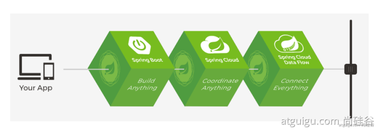
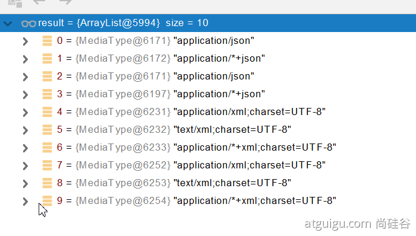
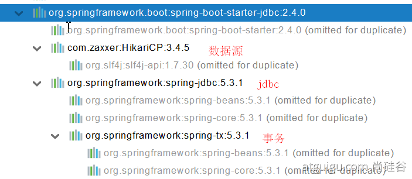

# 一、简介

SpringBoot简化了Spring技术栈的整合。

优点：


创建独立Spring应用

内嵌web服务器

自动starter依赖，简化构建配置

自动配置Spring以及第三方功能

提供生产级别的监控、健康检查及外部化配置

无代码生成、无需编写XML

## 1.1 微服务

James Lewis and Martin Fowler (2014)  提出微服务完整概念。
中文文档：https://blog.cuicc.com/blog/2015/07/22/microservices/

微服务是一种架构风格
一个应用拆分为一组小型服务
每个服务运行在自己的进程内，也就是可独立部署和升级
服务之间使用轻量级HTTP交互
服务围绕业务功能拆分
可以由全自动部署机制独立部署
去中心化，服务自治。服务可以使用不同的语言、不同的存储技术

## 1.2 分布式

部署在不同服务器上的微服务

### 分布式的困难


远程调用
服务发现
负载均衡
服务容错
配置管理
服务监控
链路追踪
日志管理
任务调度

### 分布式的解决

SpringBoot+SpringCloud



## 1.3 云原生

原应用上云。

### 上云的困难

服务自愈
弹性伸缩
服务隔离
自动化部署
灰度发布
流量治理

### 上云的解决

容器技术

# 二、开发过程

1. 引入依赖
2. 创建主程序(MainApplication)
3. 写入业务
4. 编写配置文件(application.properties/application.yml)
5. 测试运行
6. 简化部署(打包jar)


# 三、自动配置

## 3.1 SpringBoot特点

### 3.1.1 依赖管理

#### 父项目做依赖管理

1. 声明了几乎所有开发中常用的依赖的版本号。
2. 可以查找到父项目中规定依赖版本的key使用\<properties>标签来自定义版本号


#### starter场景启动器

1. spring-boot-starter-* 表示引入*场景所需要的所有依赖
2. SpringBoot所有支持的场景：https://docs.spring.io/spring-boot/docs/current/reference/html/using-spring-boot.html#using-boot-starter
3. *-spring-boot-starter： 第三方为我们提供的简化开发的场景启动器。

### 3.1.2 自动配置

自动配置Tomcat
自动配置SpringMVC
自动按规则创建包

>可以使用@SpringBootApplication(scanBasePackages="com.atguigu")
或者@ComponentScan 指定扫描路径

配置项是按需加载的

## 3.2 容器功能

### 3.2.1 组件添加

#### i @Configuration

作用：声明配置类

与Spring5的全注解开发相同

Full模式与Lite模式
配置类组件之间无依赖关系用Lite模式加速容器启动过程，减少判断
配置类组件之间有依赖关系，方法会被调用得到之前单实例组件，用Full模式

#### ii @Import

给容器中调用无参构造创建对象。

#### iii @Conditional 

条件装配：满足Conditional指定的条件，则进行组件注入

#### iv @ImportResource

导入原始的配置文件

### 3.2.2 配置绑定

如何使用Java读取到properties文件中的内容，并且把它封装到JavaBean中，以供随时使用；

1. @ConfigurationProperties
2. @EnableConfigurationProperties + @ConfigurationProperties
3. @Component + @ConfigurationProperties

## 3.3 自动配置原理入门

@SpringBootApplication是由：@SpringBootConfiguration、@ComponentScan、@EnableAutoConfiguration合成的注解

``` java
@SpringBootConfiguration
@EnableAutoConfiguration
@ComponentScan(excludeFilters = { @Filter(type = FilterType.CUSTOM, classes = TypeExcludeFilter.class),
		@Filter(type = FilterType.CUSTOM, classes = AutoConfigurationExcludeFilter.class) })
public @interface SpringBootApplication{}

```

### 3.3.1 @SpringBootConfiguration

@Configuration 代表是一个配置类

### 3.3.2 @ComponentScan

指定扫描哪些，Spring注解；

### 3.3.3 @EnableAutoConfiguration

``` java
@AutoConfigurationPackage
@Import(AutoConfigurationImportSelector.class)
public @interface EnableAutoConfiguration {}
```

#### i. @AutoConfigurationPackage

``` java
@Import(AutoConfigurationPackages.Registrar.class)  //给容器中导入一个组件
public @interface AutoConfigurationPackage {}

//利用Registrar给容器中导入一系列组件
//将指定的一个包下的所有组件导入进来？MainApplication 所在包下。
```

#### ii. @Import(AutoConfigurationImportSelector.class)

1. 利用getAutoConfigurationEntry(annotationMetadata);给容器中批量导入一些组件
2. 调用List<String> configurations = getCandidateConfigurations(annotationMetadata, attributes)获取到所有需要导入到容器中的配置类
3. 利用工厂加载 Map<String, List<String>> loadSpringFactories(@Nullable ClassLoader classLoader)；得到所有的组件
4. 从META-INF/spring.factories位置来加载一个文件。
	1. 默认扫描我们当前系统里面所有META-INF/spring.factories位置的文件
	2. spring-boot-autoconfigure-2.3.4.RELEASE.jar包里面也有META-INF/spring.factories
    

### 3.3.4 按需开启自动配置项

按照条件装配规则（@Conditional），最终会按需配置。

### 3.3.3 修改默认配置

默认会在底层配好所有的组件。但是如果用户自己配置了以用户的优先


直接自己@Bean替换底层的组件
看这个组件是获取的配置文件什么值就去修改。

## 3.4 配置流程

* 引入场景依赖
    * https://docs.spring.io/spring-boot/docs/current/reference/html/using-spring-boot.html#using-boot-starter
* 查看自动配置了哪些（选做）
    * 自己分析，引入场景对应的自动配置一般都生效了
    * 配置文件中debug=true开启自动配置报告。Negative（不生效）\Positive（生效）
* 是否需要修改
    * 参照文档修改配置项
      * https://docs.spring.io/spring-boot/docs/current/reference/html/appendix-application-properties.html#common-application-properties
      * 自己分析。xxxxProperties绑定了配置文件的哪些。
    * 自定义加入或者替换组件
      * @Bean、@Component。。。
    * 自定义器  XXXXXCustomizer；

## 3.5 配置技巧

### 3.5.1 Lombok


maven引入并且ide安装插件

#### i. 简化JavaBean开发

@Data：编译时生成属性的get&set方法
@ToString：编译时生成ToString方法
(@NoArgsConsructor/@AllArgsConsructor)：无参/全参构造器
@EqualsAndHashCode：重写Equals和HashCode方法

#### ii. 简化日志开发

@Slf4j：类中注入日志

### 3.5.2 dev-tools

项目或者页面修改以后：Ctrl+F9；就会重新编译项目

### 3.5.3 Spring Initailizr

项目初始化向导，整合在idea里

自动依赖引入
自动创建项目结构
自动编写好主配置类

# 四、配置文件

有两种配置语言properties和yaml，因为yaml更加简洁方便所以多用yaml

## 4.1 yaml

### 4.1.1 简介

YAML 是 "YAML Ain't Markup Language"（YAML 不是一种标记语言）的递归缩写。在开发的这种语言时，YAML 的意思其实是："Yet Another Markup Language"（仍是一种标记语言）。

非常适合用来做以数据为中心的配置文件

### 4.1.2 基本语法

* key: value；kv之间有空格
* 大小写敏感
* 使用缩进表示层级关系
* 缩进不允许使用tab，只允许空格
* 缩进的空格数不重要，只要相同层级的元素左对齐即可
* '#'表示注释
* 字符串无需加引号，如果要加，''与""表示字符串内容 会被 转义/不转义

#### 4.1.3 数据类型

``` yaml
# 1、字面量:单个的、不可再分的值。date、boolean、string、number、null.
k: v

# 2、对象：键值对的集合。map、hash、set、object 
k: {k1:v1,k2:v2,k3:v3}
#或
k: 
	k1: v1
  k2: v2
  k3: v3

# 3、数组：一组按次序排列的值。array、list、queue
k: [v1,v2,v3]
#或者
k:
 - v1
 - v2
 - v3
```

## 4.2 配置提示

``` xml
<!-- maven导入configuration processor包使得自定义文件有配置提示 -->
<dependency>
    <groupId>org.springframework.boot</groupId>
    <artifactId>spring-boot-configuration-processor</artifactId>
    <optional>true</optional>
</dependency>

<!-- 设置Spring打包时不打包只在开发时使用的的工具 -->
<build>
    <plugins>
        <plugin>
            <groupId>org.springframework.boot</groupId>
            <artifactId>spring-boot-maven-plugin</artifactId>
            <configuration>
                <excludes>
                    <exclude>
                        <groupId>org.springframework.boot</groupId>
                        <artifactId>spring-boot-configuration-processor</artifactId>
                    </exclude>
                </excludes>
            </configuration>
        </plugin>
    </plugins>
</build>
```

# 五、web开发

## 5.1 简单功能分析

### 5.1.1 静态资源访问

静态资源：前端的固定页面，这里面包含HTML、CSS、JS、图片等等不需要查数据库也不需要程序处理，直接就能够显示的页面。

#### i. 静态资源目录

放在类路径下 ：/static (or /public or /resources or /META-INF/resources
访问 ： 当前项目根路径/ + 静态资源名 

原理：请求进来，先去找Controller看能不能处理。不能处理的所有请求又都交给静态资源处理器。静态资源也找不到则响应404页面。

改变默认的静态资源路径：

``` yaml
spring:
  mvc:
    static-path-pattern: /res/**

web:
  resources:
    static-locations: classpath:/haha/
```

当前项目 + static-path-pattern + 静态资源名 = 静态资源文件夹下找

> 注：static-path-pattern为虚拟路径，真实路径为static-locations中的路径

#### ii. webjar

https://www.webjars.org/


把一些东西打包成可以静态访问的jar包

自动映射 /webjars/**

### 5.1.2 欢迎页

* 静态资源路径下  index.html
* controller能处理/index


### 5.1.3 自定义Favicon

Facicon：标签页小图标

favicon.ico 放在静态资源目录下即可。

## 5.2 请求参数处理

### 5.2.1 请求映射

同SpringMVC。

>注
SpringBoot自动配置欢迎页的 WelcomePageHandlerMapping 。访问 /能访问到index.html；
SpringBoot自动配置了默认 的 RequestMappingHandlerMapping

### 5.2.2 普通参数与基本注解

#### 注解

@PathVariable：路径
@RequestHeader：请求头
@RequestParam：请求参数
@RequestAttribute：Request域属性
@CookieValue：Cookie域属性
@MatrixVariable：矩阵变量；2.7.2版本之前SpringBoot默认禁用。
@RequestBody：请求体

#### ServletAPI

WebRequest
ServletRequest
MultipartRequest
HttpSession
javax.servlet.http.PushBuilder
Principal
InputStream
Reader
HttpMethod
Locale
TimeZone
ZoneId

#### 复杂参数

Map、Model（map、model里面的数据会被放在request的请求域  request.setAttribute）
Errors/BindingResult
RedirectAttributes（ 重定向携带数据）
ServletResponse（response）
SessionStatus
UriComponentsBuilder
ServletUriComponentsBuilder

#### 自定义对象参数

## 5.3 数据响应与内容协商

###  5.3.1 响应JSON

使用jackson.jar+@ResponseBody可以实现给前端自动返回json数据；

#### 返回值处理器原理

1. 返回值处理器判断是否支持这种类型返回值 supportsReturnType
2. 返回值处理器调用 handleReturnValue 进行处理
3. RequestResponseBodyMethodProcessor 可以处理返回值标了@ResponseBody 注解的。
4. 利用 MessageConverters 进行处理 将数据写为json
    1. 内容协商（浏览器默认会以请求头的方式告诉服务器他能接受什么样的内容类型）
    2. 服务器最终根据自己自身的能力，决定服务器能生产出什么样内容类型的数据，
    3. SpringMVC会挨个遍历所有容器底层的 HttpMessageConverter ，看谁能处理？
        1. 得到MappingJackson2HttpMessageConverter可以将对象写为json
        2. 利用MappingJackson2HttpMessageConverter将对象转为json再写出去。

#### HTTPMessageConverter原理

看是否支持将此Class类型的对象，转为MediaType类型的数据。

### 5.3.2 内容协商

根据客户端需求，返回不同媒体类型的数据。

根据的是请求头中Accept字段。Http协议中规定的，告诉服务器本客户端可以接收的数据类型。
浏览器发送不同请求可以在SpringBoot设置中开启根据参数内容协商，根据参数format

#### 原理

1. 判断当前响应头中是否已经有确定的媒体类型。MediaType
2. 获取客户端（PostMan、浏览器）支持接收的内容类型。（获取客户端Accept请求头字段）
3. 遍历循环所有当前系统的 MessageConverter，看谁支持操作这个对象
4. 找到支持的converter，把converter支持的媒体类型统计出来。
   
5. 进行内容协商的最佳匹配媒体类型
6. 用支持将对象转为最佳匹配媒体类型的converter。调用它进行转化 。

#### 自定义MessageConverter

实现多协议数据兼容。json、xml、x-jiao

方法一：使用WebMvcConfigurer类中的
方法二：配置文件配置spring.mvc.contentnegotiation.media-types.*

方法一会导致覆盖默认很多功能，导致一些默认的功能失效。

## 5.4 视图解析与模板引擎

### 5.4.1 原理

1. 目标方法处理的过程中，所有数据都会被放在 ModelAndViewContainer 里面。包括数据和视图地址
2. 方法的参数是一个自定义类型对象（从请求参数中确定的），把他重新放在 ModelAndViewContainer
3. 任何目标方法执行完成以后都会返回 ModelAndView（数据和视图地址）。
4. processDispatchResult  处理派发结果（页面改如何响应）
   * render(mv, request, response); 进行页面渲染逻辑
      * 根据方法的String返回值得到 View 对象【定义了页面的渲染逻辑】
         1. 所有的视图解析器尝试是否能根据当前返回值得到View对象
         2. 得到了  redirect:/main.html --> Thymeleaf new RedirectView()
         3. ContentNegotiationViewResolver 里面包含了下面所有的视图解析器，内部还是利用下面所有视图解析器得到视图对象。
         4. view.render(mv.getModelInternal(), request, response);   视图对象调用自定义的render进行页面渲染工作
            * RedirectView 如何渲染【重定向到一个页面】
               1. 获取目标url地
               2. response.sendRedirect(encodedURL);

### 5.4.2 模板引擎Thymeleaf

Thymeleaf：Thymeleaf.md

## 5.5 拦截器

### 5.5.1 HandlerInterceptor 接口

先配置好拦截器拦截业务
放入容器中

## 5.6 文件上传

### 5.6.1 页面表单

``` html
<form method="post" action="/upload" enctype="multipart/form-data">
    <input type="file" name="file"><br>
    <input type="submit" value="提交">
</form>
```

### 5.6.2 文件上传代码

``` java
/**
* MultipartFile 自动封装上传过来的文件
* @param email
* @param username
* @param headerImg
* @param photos
* @return
*/
@PostMapping("/upload")
public String upload(@RequestParam("email") String email,
                    @RequestParam("username") String username,
                    @RequestPart("headerImg") MultipartFile headerImg,
                    @RequestPart("photos") MultipartFile[] photos) throws IOException {

   log.info("上传的信息：email={}，username={}，headerImg={}，photos={}",
           email,username,headerImg.getSize(),photos.length);

   if(!headerImg.isEmpty()){
       //保存到文件服务器，OSS服务器
       String originalFilename = headerImg.getOriginalFilename();
       headerImg.transferTo(new File("H:\\cache\\"+originalFilename));
   }

   if(photos.length > 0){
       for (MultipartFile photo : photos) {
           if(!photo.isEmpty()){
               String originalFilename = photo.getOriginalFilename();
               photo.transferTo(new File("H:\\cache\\"+originalFilename));
           }
       }
   }


   return "main";
}
```

## 5.7 异常处理

### 5.7.1 错误处理

#### 默认规则

SpringBoot默认提供/error处理所有错误的映射

对于机器客户端，它将生成JSON响应，其中包含错误，HTTP状态和异常消息的详细信息。
对于浏览器客户端，响应一个“ whitelabel”错误视图，以HTML格式呈现相同的数据

添加View解析为error就可以自定义error页面了
要完全替换默认行为，可以实现 ErrorController 并注册该类型的Bean定义，或添加ErrorAttributes类型的组件以使用现有机制但替换其内容。

error/下的4xx，5xx页面会被自动解析

### 5.7.2 异常处理步骤流程

1. 执行目标方法，目标方法运行期间有任何异常都会被catch、而且标志当前请求结束；并且用 dispatchException 
2. 进入视图解析流程（页面渲染？） processDispatchResult(processedRequest, response, mappedHandler, mv, dispatchException);
3. mv = processHandlerException；处理handler发生的异常，处理完成返回ModelAndView；
   1. 遍历所有的 handlerExceptionResolvers，看谁能处理当前异常【HandlerExceptionResolver处理器异常解析器】
   2. 系统默认的异常解析器；
      - DefaultErrorAttributes先来处理异常。把异常信息保存到rrequest域，并且返回null；
      - 默认没有任何人能处理异常，所以异常会被抛出
        1. 如果没有任何人能处理最终底层就会发送 /error 请求。会被底层的BasicErrorController处理
        2. 解析错误视图；遍历所有的  ErrorViewResolver  看谁能解析。
        3. 默认的 DefaultErrorViewResolver ,作用是把响应状态码作为错误页的地址，error/500.html 
        4. 模板引擎最终响应这个页面 error/500.html 

## 5.8 Web原生组件注入

### 5.8.1 使用Servelt API

@ServletComponentScan(basePackages = "com.jiao.admin") :指定原生Servlet组件都放在那里

@WebServlet(urlPatterns = "/my")：效果：直接响应，没有经过Spring的拦截器？
@WebFilter(urlPatterns={"/css/*","/images/*"})
@WebListener

### 5.8.2 使用RegistrationBean

ServletRegistrationBean, FilterRegistrationBean, and ServletListenerRegistrationBean

``` java
@Configuration
public class MyRegistConfig {

    @Bean
    public ServletRegistrationBean myServlet(){
        MyServlet myServlet = new MyServlet();

        return new ServletRegistrationBean(myServlet,"/my","/my02");
    }


    @Bean
    public FilterRegistrationBean myFilter(){

        MyFilter myFilter = new MyFilter();
//        return new FilterRegistrationBean(myFilter,myServlet());
        FilterRegistrationBean filterRegistrationBean = new FilterRegistrationBean(myFilter);
        filterRegistrationBean.setUrlPatterns(Arrays.asList("/my","/css/*"));
        return filterRegistrationBean;
    }

    @Bean
    public ServletListenerRegistrationBean myListener(){
        MySwervletContextListener mySwervletContextListener = new MySwervletContextListener();
        return new ServletListenerRegistrationBean(mySwervletContextListener);
    }
}
```


## 5.9 嵌入式Servelt容器

### 5.9.1 切换嵌入式Servelt容器

默认支持的webServer：Tomcat, Jetty, or Undertow
ServletWebServerApplicationContext 容器启动寻找ServletWebServerFactory 并引导创建服务器

#### 原理

* SpringBoot应用启动发现当前是Web应用。web场景包-导入tomcat
* web应用会创建一个web版的ioc容器ServletWebServerApplicationContext 
* ServletWebServerApplicationContext  启动的时候寻找 ServletWebServerFactory（Servlet 的web服务器工厂---> Servlet 的web服务器）  
* SpringBoot底层默认有很多的WebServer工厂；TomcatServletWebServerFactory, JettyServletWebServerFactory, or UndertowServletWebServerFactory
* 底层直接会有一个自动配置类。ServletWebServerFactoryAutoConfiguration
* ServletWebServerFactoryAutoConfiguration导入了ServletWebServerFactoryConfiguration（配置类）
* ServletWebServerFactoryConfiguration 配置类 根据动态判断系统中到底导入了那个Web服务器的包。（默认是web-starter导入tomcat包），容器中就有 TomcatServletWebServerFactory
* TomcatServletWebServerFactory 创建出Tomcat服务器并启动；TomcatWebServer 的构造器拥有初始化方法initialize---this.tomcat.start();
* 内嵌服务器，就是手动把启动服务器的代码调用（tomcat核心jar包存在）

### 5.9.2 定制Servlet容器

* 实现  WebServerFactoryCustomizer<ConfigurableServletWebServerFactory> 
  * 把配置文件的值和ServletWebServerFactory 进行绑定
* 修改配置文件 server .xxx
* 直接自定义 ConfigurableServletWebServerFactory 

## 5.10 定制化原理

* 修改配置文件；
* xxxxxCustomizer；
* 编写自定义的配置类   xxxConfiguration；+ @Bean替换、增加容器中默认组件；视图解析器 
* **Web应用 编写一个配置类实现 WebMvcConfigurer 即可定制化web功能；+ @Bean给容器中再扩展一些组件**
* @EnableWebMvc + WebMvcConfigurer —— @Bean  可以全面接管SpringMVC，所有规则全部自己重新配置； 实现定制和扩展功能


# 六、数据访问

## 6.1 SQL

### 6.1.1 自动配置数据源-HikariDataSource



单独根据数据库版本导入相应版本的驱动

#### 自动配置

* DataSourceAutoConfiguration ： 数据源的自动配置
  * 修改数据源相关的配置：spring.datasource
  * 数据库连接池的配置，是自己容器中没有DataSource才自动配置的
  * 底层配置好的连接池是：HikariDataSource
* DataSourceTransactionManagerAutoConfiguration： 事务管理器的自动配置
* JdbcTemplateAutoConfiguration： JdbcTemplate的自动配置，可以来对数据库进行crud
  * 可以修改这个配置项@ConfigurationProperties(prefix = "spring.jdbc") 来修改JdbcTemplate
  * @Bean@Primary    JdbcTemplate；容器中有这个组件
* JndiDataSourceAutoConfiguration： jndi的自动配置
* XADataSourceAutoConfiguration： 分布式事务相关的

### 6.1.2 Druid

druid官方github地址
https://github.com/alibaba/druid

* 有两种方式
  * 自定义方式
  * 官方stater方式


### 6.1.3 MyBatis

https://github.com/mybatis

#### 配置模式

全局配置文件：
* SqlSessionFactory: 自动配置好了
* SqlSession：自动配置了 SqlSessionTemplate 组合了SqlSession
* @Import(AutoConfiguredMapperScannerRegistrar.class）；
* Mapper： 只要我们写的操作MyBatis的接口标准了 @Mapper 就会被自动扫描进来

过程：

* 导入mybatis官方starter
* 编写mapper接口。标准@Mapper注解
* 编写sql映射文件并绑定mapper接口
* 在application.yaml中指定Mapper配置文件的位置，以及指定全局配置文件的信息 （建议；配置在mybatis.configuration）

### 6.1.4 MyBatisPlus

## 6.2 NoSQL

### 6.2.1 Redis自动配置

### 6.2.2 RedisTemplate与Lettuce

### 6.2.3 jedis


# 七、单元测试

# 八、指标监控

# 九、原理解析


# 参考文献

[官方文档](https://docs.spring.io/spring-boot/docs/current/reference/htmlsingle/)

[尚硅谷(视频)](https://www.bilibili.com/video/BV19K4y1L7MT)

[尚硅谷(笔记)](https://www.yuque.com/atguigu/springboot)