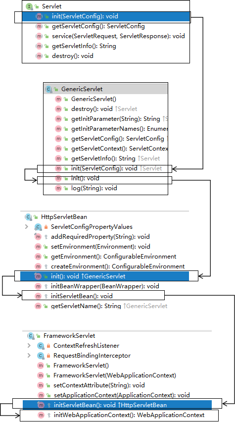

# 一、概念

SpringMVC是Spring的一个后续产品，是Spring的一个子项目
SpringMVC 是 Spring 为表述层开发提供的一整套完备的解决方案。

>注：三层架构分为表述层（或表示层）、业务逻辑层、数据访问层，表述层表示前台页面和后台servlet

>注：
/所匹配的请求可以是/login或.html或.js或.css方式的请求路径，但是/不能匹配.jsp请求路径的请求
/*则能够匹配所有请求，例如在使用过滤器时，若需要对所有请求进行过滤，就需要使用/*的写法

# 二、@RequesetMapping

将请求和处理请求的控制器方法关联起来，建立映射关系。

## 2.1 位置

``` java
@Controller
@RequestMapping("/test")
public class RequestMappingController {

    //此时请求映射所映射的请求的请求路径为：/test/testRequestMapping
    @RequestMapping("/testRequestMapping")
    public String testRequestMapping(){
        return "success";
    }

}
```

## 2.2 value属性

value是个列表表示该请求映射能够匹配多个请求地址所对应的请求

``` java
@RequestMapping(
        value = {"/testRequestMapping", "/test"}
)
public String testRequestMapping(){
    return "success";
}
```

## 2.3 method属性

通过请求的请求方式（get或post）匹配请求映射默认两者都接受。


> 注
1、对于处理指定请求方式的控制器方法，SpringMVC中提供了@RequestMapping的派生注解
处理get请求的映射-->@GetMapping
处理post请求的映射-->@PostMapping
处理put请求的映射-->@PutMapping
处理delete请求的映射-->@DeleteMapping
2、常用的请求方式有get，post，put，delete
但是目前浏览器只支持get和post，若在form表单提交时，为method设置了其他请求方式的字符串（put或delete），则按照默认的请求方式get处理
若要发送put和delete请求，则需要通过spring提供的过滤器HiddenHttpMethodFilter，在RESTful部分会讲到

## 2.4 params属性

通过请求的请求参数匹配请求映射

"param"：要求请求映射所匹配的请求必须携带param请求参数

"!param"：要求请求映射所匹配的请求必须不能携带param请求参数

"param=value"：要求请求映射所匹配的请求必须携带param请求参数且param=value

"param!=value"：要求请求映射所匹配的请求必须携带param请求参数但是param!=value

## 2.5 headers属性

通过请求的请求头信息匹配请求映射

"header"：要求请求映射所匹配的请求必须携带header请求头信息

"!header"：要求请求映射所匹配的请求必须不能携带header请求头信息

"header=value"：要求请求映射所匹配的请求必须携带header请求头信息且header=value

"header!=value"：要求请求映射所匹配的请求必须携带header请求头信息且header!=value

## 2.6 ant风格的路径

？：表示任意的单个字符

*：表示任意的0个或多个字符

\**：表示任意的一层或多层目录

注意：在使用\**时，只能使用/**/xxx的方式

## 2.7 路径中的占位符

原始方式：/deleteUser?id=1

rest方式：/deleteUser/1

SpringMVC路径中的占位符常用于RESTful风格中，当请求路径中将某些数据通过路径的方式传输到服务器中，就可以在相应的@RequestMapping注解的value属性中通过占位符{xxx}表示传输的数据，在通过@PathVariable注解，将占位符所表示的数据赋值给控制器方法的形参

``` html
<a th:href="@{/testRest/1/admin}">测试路径中的占位符-->/testRest</a><br>
```

``` java
@RequestMapping("/testRest/{id}/{username}")
public String testRest(@PathVariable("id") String id, @PathVariable("username") String username){
    System.out.println("id:"+id+",username:"+username);
    return "success";
}
//最终输出的内容为-->id:1,username:admin
```

# 三、SpringMVC获取请求参数

## 3.1 通过ServletAPI获取

与传统servlet相同通过HttpServletRequest

## 3.2 通过控制器方法的形参获取请求参数

``` html
<a th:href="@{/testParam(username='admin',password=123456)}">测试获取请求参数-->/testParam</a><br>
```

``` java
@RequestMapping("/testParam")
public String testParam(String username, String password){
    System.out.println("username:"+username+",password:"+password);
    return "success";
}
```

>注：
若请求所传输的请求参数中有多个同名的请求参数，此时可以在控制器方法的形参中设置字符串数组或者字符串类型的形参接收此请求参数
若使用字符串数组类型的形参，此参数的数组中包含了每一个数据
若使用字符串类型的形参，此参数的值为每个数据中间使用逗号拼接的结果

## 3.3 @RequestParam

将请求参数和控制器方法的形参创建映射关系

属性：
* value：指定为形参赋值的请求参数的参数名
* required：设置是否必须传输此请求参数，默认值为true
    * true:不传输且没有设置默认值就报错
    * false：不传输为null
* defaultValue：不管required属性值为true或false，当value所指定的请求参数没有传输或传输的值为""时，则使用默认值为形参赋值

## 3.4 @RequestHeader

将请求头信息和控制器方法的形参创建映射关系

共有三个属性：同上

## 3.5 @CookieValue

将cookie数据和控制器方法的形参创建映射关系

三个属性：同上

## 3.6 通过POJO获取请求参数

在控制器方法的形参位置设置一个实体类类型的形参，此时若浏览器传输的请求参数的参数名和实体类中的属性名一致，那么请求参数就会为此属性赋值

# 四、域对象共享数据

域内的对象共享一个物理位置

## 4.1 request域对象共享数据

### 4.1.1 代码

``` java

// ServletAPI
@RequestMapping("/testServletAPI")
public String testServletAPI(HttpServletRequest request){
    request.setAttribute("testScope", "hello,servletAPI");
    return "success";
}

// ModelAndView
@RequestMapping("/testModelAndView")
public ModelAndView testModelAndView(){
    /**
     * ModelAndView有Model和View的功能
     * Model主要用于向请求域共享数据
     * View主要用于设置视图，实现页面跳转
     */
    ModelAndView mav = new ModelAndView();
    //向请求域共享数据
    mav.addObject("testScope", "hello,ModelAndView");
    //设置视图，实现页面跳转
    mav.setViewName("success");
    return mav;
}

// Model
@RequestMapping("/testModel")
public String testModel(Model model){
    model.addAttribute("testScope", "hello,Model");
    return "success";
}

// map
@RequestMapping("/testMap")
public String testMap(Map<String, Object> map){
    map.put("testScope", "hello,Map");
    return "success";
}

// ModelMap
@RequestMapping("/testModelMap")
public String testModelMap(ModelMap modelMap){
    modelMap.addAttribute("testScope", "hello,ModelMap");
    return "success";
}
```

### 4.1.2 Model、ModelMap、Map的关系

本质上都是 BindingAwareModelMap 类型的
``` java
public interface Model{}
public class ModelMap extends LinkedHashMap<String, Object> {}
public class ExtendedModelMap extends ModelMap implements Model {}
public class BindingAwareModelMap extends ExtendedModelMap {}
```

## 4.2 向session域共享数据

``` java

//ServletAPI
@RequestMapping("/testSession")
public String testSession(HttpSession session){
    session.setAttribute("testSessionScope", "hello,session");
    return "success";
}
```

## 4.3 向application域共享数据

``` java

//ServletAPI
@RequestMapping("/testApplication")
public String testApplication(HttpSession session){
    ServletContext application = session.getServletContext();
    application.setAttribute("testApplicationScope", "hello,application");
    return "success";
}
```

# 五、SpringMVC的视图

是View接口，作用是渲染数据，将模型Model中的数据展示给用户

当工程引入jstl的依赖，转发视图会自动转换为JstlView

若使用的视图技术为Thymeleaf，在SpringMVC的配置文件中配置了Thymeleaf的视图解析器，由此视图解析器解析之后所得到的是ThymeleafView

## 5.1 ThymeleafView

直接跳转到页面

控制器方法中所设置的视图名称没有任何前缀

视图名称拼接视图前缀和视图后缀所得到的最终路径，会通过转发的方式实现跳转

## 5.2 转发视图

就是跳转到某一个请求

默认的转发视图是InternalResourceView

"forward:"为前缀时，创建InternalResourceView视图，此时的视图名称不会被SpringMVC配置文件中所配置的视图解析器解析，而是会将前缀"forward:"去掉，剩余部分作为最终路径通过转发的方式实现跳转

## 5.3 重定向视图

也是跳转到某一个请求，不过是以重定向的方式

默认的重定向视图是RedirectView

"redirect:"为前缀时，创建RedirectView视图，此时的视图名称不会被SpringMVC配置文件中所配置的视图解析器解析，而是会将前缀"redirect:"去掉，剩余部分作为最终路径通过重定向的方式实现跳转


## 5.4 视图控制器view-controller

只需要设置视图名称

``` xml 
<!--
    path：设置处理的请求地址
    view-name：设置请求地址所对应的视图名称
-->
<mvc:view-controller path="/testView" view-name="success"></mvc:view-controller>
```

>注：
当SpringMVC中设置任何一个view-controller时，其他控制器中的请求映射将全部失效，此时需要在SpringMVC的核心配置文件中设置开启mvc注解驱动的标签：<mvc:annotation-driven />

## 5.5 视图解析器 InternalResourceViewResolver

JSP解析

# 六、RESTful

是一种软件架构的风格

## 6.1 简介

REST：Representational State Transfer，表现层资源状态转移。

表现层：View->Controller的过程

资源：每个资源是服务器上一个可命名的抽象概念

资源的表述：是一段对于资源在某个特定时刻的状态的描述。

状态转移：在客户端和服务器端之间转移（transfer）代表资源状态的表述。通过转移和操作资源的表述，来间接实现操作资源的目的。

| 操作     | 传统方式         | REST风格                |
| -------- | ---------------- | ----------------------- |
| 查询操作 | getUserById?id=1 | user/1-->get请求方式    |
| 保存操作 | saveUser         | user-->post请求方式     |
| 删除操作 | deleteUser?id=1  | user/1-->delete请求方式 |
| 更新操作 | updateUser       | user-->put请求方式      |

## 6.2 HiddenHttpMethodFilter

是一个过滤器

浏览器只接受get和post使用HiddenHttpMethodFilter将POST请求转换为DELETE和PUT请求

# 七、HttpMessageConverter

报文信息转换器，将请求报文转换为Java对象，或将Java对象转换为响应报文

## 7.1 @RequestBody

可以获取请求体，需要在控制器方法设置一个形参，使用@RequestBody进行标识

## 7.2 RequestEntity

可以封装请求报文控制器方法的形参中设置该类型的形参，当前请求的请求报文就会赋值给该形参

## 7.3 @ResponseBody

用于标识一个控制器方法，可以将该方法的返回值直接作为响应报文的响应体响应到浏览器

## 7.4 处理json

开启mvc的注解驱动后在HandlerAdaptor中会自动装配一个消息转换器：MappingJackson2HttpMessageConverter，可以将响应到浏览器的Java对象转换为Json格式的字符串

将Java对象直接作为控制器方法的返回值返回，就会自动转换为Json格式的字符串

## 7.5 @RestControlle

标识在控制器的类上，就相当于为类添加了@Controller注解，并且为其中的每个方法添加了@ResponseBody注解

## 7.6 ResponseEntity

自定义的响应报文。

# 八、拦截器(interceptor)

用于拦截控制器方法的执行

## 8.1 三个方法
preHandle：控制器方法执行之前执行preHandle()，其boolean类型的返回值表示是否拦截或放行，返回true为放行，即调用控制器方法；返回false表示拦截，即不调用控制器方法

postHandle：控制器方法执行之后执行postHandle()

afterComplation：处理完视图和模型数据，渲染视图完毕之后执行afterComplation()

## 8.2 多个拦截器的执行顺序

### 8.2.1 若每个拦截器的preHandle()都返回true

此时多个拦截器的执行顺序和拦截器在SpringMVC的配置文件的配置顺序有关：

preHandle()会按照配置的顺序执行，而postHandle()和afterComplation()会按照配置的反序执行

### 8.2.2 若某个拦截器的preHandle()返回了false

preHandle()返回false和它之前的拦截器的preHandle()都会执行，postHandle()都不执行，返回false的拦截器之前的拦截器的afterComplation()会执行

## 8.3 配置

``` java
<bean class="com.atguigu.interceptor.FirstInterceptor"></bean>
<ref bean="firstInterceptor"></ref>
<!-- 以上两种配置方式都是对DispatcherServlet所处理的所有的请求进行拦截 -->
<mvc:interceptor>
    <mvc:mapping path="/**"/>
    <mvc:exclude-mapping path="/testRequestEntity"/>
    <ref bean="firstInterceptor"></ref>
</mvc:interceptor>
<!-- 
    以上配置方式可以通过ref或bean标签设置拦截器，通过mvc:mapping设置需要拦截的请求，通过mvc:exclude-mapping设置需要排除的请求，即不需要拦截的请求
-->
```

# 九、异常处理器

## 9.1 配置

HandlerExceptionResolver接口的实现类有：DefaultHandlerExceptionResolver和SimpleMappingExceptionResolver

自定义的异常处理器SimpleMappingExceptionResolver，使用方式：

``` java
<bean class="org.springframework.web.servlet.handler.SimpleMappingExceptionResolver">
    <property name="exceptionMappings">
        <props>
            <!--
                properties的键表示处理器方法执行过程中出现的异常
                properties的值表示若出现指定异常时，设置一个新的视图名称，跳转到指定页面
            -->
            <prop key="java.lang.ArithmeticException">error</prop>
        </props>
    </property>
    <!--
        exceptionAttribute属性设置一个属性名，将出现的异常信息在请求域中进行共享
    -->
    <property name="exceptionAttribute" value="ex"></property>
</bean>
```


## 9.2 注解

``` java
//@ControllerAdvice将当前类标识为异常处理的组件
@ControllerAdvice
public class ExceptionController {

    //@ExceptionHandler用于设置所标识方法处理的异常
    @ExceptionHandler(ArithmeticException.class)
    //ex表示当前请求处理中出现的异常对象
    public String handleArithmeticException(Exception ex, Model model){
        model.addAttribute("ex", ex);
        return "error";
    }

}
```


# 十、注解配置SpringMVC

## 10.1 创建初始化类，代替web.xml

在Servlet3.0环境中，容器会在类路径中查找实现javax.servlet.ServletContainerInitializer接口的类，如果找到的话就用它来配置Servlet容器。

Spring提供了这个接口的实现，名为SpringServletContainerInitializer，这个类反过来又会查找实现WebApplicationInitializer的类并将配置的任务交给它们来完成。

Spring3.2引入了一个便利的WebApplicationInitializer基础实现，名为AbstractAnnotationConfigDispatcherServletInitializer，当我们的类扩展了AbstractAnnotationConfigDispatcherServletInitializer并将其部署到Servlet3.0容器的时候，容器会自动发现它，并用它来配置Servlet上下文。

``` java
public class WebInit extends AbstractAnnotationConfigDispatcherServletInitializer {

    /**
     * 指定spring的配置类
     * @return
     */
    @Override
    protected Class<?>[] getRootConfigClasses() {
        return new Class[]{SpringConfig.class};
    }

    /**
     * 指定SpringMVC的配置类
     * @return
     */
    @Override
    protected Class<?>[] getServletConfigClasses() {
        return new Class[]{WebConfig.class};
    }

    /**
     * 指定DispatcherServlet的映射规则，即url-pattern
     * @return
     */
    @Override
    protected String[] getServletMappings() {
        return new String[]{"/"};
    }

    /**
     * 添加过滤器
     * @return
     */
    @Override
    protected Filter[] getServletFilters() {
        CharacterEncodingFilter encodingFilter = new CharacterEncodingFilter();
        encodingFilter.setEncoding("UTF-8");
        encodingFilter.setForceRequestEncoding(true);
        HiddenHttpMethodFilter hiddenHttpMethodFilter = new HiddenHttpMethodFilter();
        return new Filter[]{encodingFilter, hiddenHttpMethodFilter};
    }
}
```

## 10.2 创建SpringConfig配置类，代替spring的配置文件

``` java
@Configuration
public class SpringConfig {
    //ssm整合之后，spring的配置信息写在此类中
}
```

## 10.3 创建WebConfig配置类，代替SpringMVC的配置文件

``` java
@Configuration
//扫描组件
@ComponentScan("com.atguigu.mvc.controller")
//开启MVC注解驱动
@EnableWebMvc
public class WebConfig implements WebMvcConfigurer {

    //使用默认的servlet处理静态资源
    @Override
    public void configureDefaultServletHandling(DefaultServletHandlerConfigurer configurer) {
        configurer.enable();
    }

    //配置文件上传解析器
    @Bean
    public CommonsMultipartResolver multipartResolver(){
        return new CommonsMultipartResolver();
    }

    //配置拦截器
    @Override
    public void addInterceptors(InterceptorRegistry registry) {
        FirstInterceptor firstInterceptor = new FirstInterceptor();
        registry.addInterceptor(firstInterceptor).addPathPatterns("/**");
    }
    
    //配置视图控制
    
    /*@Override
    public void addViewControllers(ViewControllerRegistry registry) {
        registry.addViewController("/").setViewName("index");
    }*/
    
    //配置异常映射
    /*@Override
    public void configureHandlerExceptionResolvers(List<HandlerExceptionResolver> resolvers) {
        SimpleMappingExceptionResolver exceptionResolver = new SimpleMappingExceptionResolver();
        Properties prop = new Properties();
        prop.setProperty("java.lang.ArithmeticException", "error");
        //设置异常映射
        exceptionResolver.setExceptionMappings(prop);
        //设置共享异常信息的键
        exceptionResolver.setExceptionAttribute("ex");
        resolvers.add(exceptionResolver);
    }*/

    //配置生成模板解析器
    @Bean
    public ITemplateResolver templateResolver() {
        WebApplicationContext webApplicationContext = ContextLoader.getCurrentWebApplicationContext();
        // ServletContextTemplateResolver需要一个ServletContext作为构造参数，可通过WebApplicationContext 的方法获得
        ServletContextTemplateResolver templateResolver = new ServletContextTemplateResolver(
                webApplicationContext.getServletContext());
        templateResolver.setPrefix("/WEB-INF/templates/");
        templateResolver.setSuffix(".html");
        templateResolver.setCharacterEncoding("UTF-8");
        templateResolver.setTemplateMode(TemplateMode.HTML);
        return templateResolver;
    }

    //生成模板引擎并为模板引擎注入模板解析器
    @Bean
    public SpringTemplateEngine templateEngine(ITemplateResolver templateResolver) {
        SpringTemplateEngine templateEngine = new SpringTemplateEngine();
        templateEngine.setTemplateResolver(templateResolver);
        return templateEngine;
    }

    //生成视图解析器并未解析器注入模板引擎
    @Bean
    public ViewResolver viewResolver(SpringTemplateEngine templateEngine) {
        ThymeleafViewResolver viewResolver = new ThymeleafViewResolver();
        viewResolver.setCharacterEncoding("UTF-8");
        viewResolver.setTemplateEngine(templateEngine);
        return viewResolver;
    }


}
```

# 十一、SpringMVC执行流程

## 11.1 SpringMVC常用组件

DispatcherServlet：前端控制器;统一处理请求和响应，整个流程控制的中心，由它调用其它组件处理用户的请求

HandlerMapping：处理器映射器;根据请求的url、method等信息查找Handler，即控制器方法

Handler：处理器;在DispatcherServlet的控制下Handler对具体的用户请求进行处理

HandlerAdapter：处理器适配器;通过HandlerAdapter对处理器（控制器方法）进行执行

ViewResolver：视图解析器;进行视图解析，得到相应的视图，例如：ThymeleafView、InternalResourceView、RedirectView

View：视图;将模型数据通过页面展示给用户


## 11.2 DispatcherServlet初始化过程

DispatcherServlet 本质上是一个 Servlet，宏观上是 Servlet 生命周期来进行调度。



##### a>初始化WebApplicationContext

所在类：org.springframework.web.servlet.FrameworkServlet

```java
protected WebApplicationContext initWebApplicationContext() {
    WebApplicationContext rootContext =
        WebApplicationContextUtils.getWebApplicationContext(getServletContext());
    WebApplicationContext wac = null;

    if (this.webApplicationContext != null) {
        // A context instance was injected at construction time -> use it
        wac = this.webApplicationContext;
        if (wac instanceof ConfigurableWebApplicationContext) {
            ConfigurableWebApplicationContext cwac = (ConfigurableWebApplicationContext) wac;
            if (!cwac.isActive()) {
                // The context has not yet been refreshed -> provide services such as
                // setting the parent context, setting the application context id, etc
                if (cwac.getParent() == null) {
                    // The context instance was injected without an explicit parent -> set
                    // the root application context (if any; may be null) as the parent
                    cwac.setParent(rootContext);
                }
                configureAndRefreshWebApplicationContext(cwac);
            }
        }
    }
    if (wac == null) {
        // No context instance was injected at construction time -> see if one
        // has been registered in the servlet context. If one exists, it is assumed
        // that the parent context (if any) has already been set and that the
        // user has performed any initialization such as setting the context id
        wac = findWebApplicationContext();
    }
    if (wac == null) {
        // No context instance is defined for this servlet -> create a local one
        // 创建WebApplicationContext
        wac = createWebApplicationContext(rootContext);
    }

    if (!this.refreshEventReceived) {
        // Either the context is not a ConfigurableApplicationContext with refresh
        // support or the context injected at construction time had already been
        // refreshed -> trigger initial onRefresh manually here.
        synchronized (this.onRefreshMonitor) {
            // 刷新WebApplicationContext
            onRefresh(wac);
        }
    }

    if (this.publishContext) {
        // Publish the context as a servlet context attribute.
        // 将IOC容器在应用域共享
        String attrName = getServletContextAttributeName();
        getServletContext().setAttribute(attrName, wac);
    }

    return wac;
}
```

##### b>创建WebApplicationContext

所在类：org.springframework.web.servlet.FrameworkServlet

```java
protected WebApplicationContext createWebApplicationContext(@Nullable ApplicationContext parent) {
    Class<?> contextClass = getContextClass();
    if (!ConfigurableWebApplicationContext.class.isAssignableFrom(contextClass)) {
        throw new ApplicationContextException(
            "Fatal initialization error in servlet with name '" + getServletName() +
            "': custom WebApplicationContext class [" + contextClass.getName() +
            "] is not of type ConfigurableWebApplicationContext");
    }
    // 通过反射创建 IOC 容器对象
    ConfigurableWebApplicationContext wac =
        (ConfigurableWebApplicationContext) BeanUtils.instantiateClass(contextClass);

    wac.setEnvironment(getEnvironment());
    // 设置父容器
    wac.setParent(parent);
    String configLocation = getContextConfigLocation();
    if (configLocation != null) {
        wac.setConfigLocation(configLocation);
    }
    configureAndRefreshWebApplicationContext(wac);

    return wac;
}
```

##### c>DispatcherServlet初始化策略

FrameworkServlet创建WebApplicationContext后，刷新容器，调用onRefresh(wac)，此方法在DispatcherServlet中进行了重写，调用了initStrategies(context)方法，初始化策略，即初始化DispatcherServlet的各个组件

所在类：org.springframework.web.servlet.DispatcherServlet

```java
protected void initStrategies(ApplicationContext context) {
   initMultipartResolver(context);
   initLocaleResolver(context);
   initThemeResolver(context);
   initHandlerMappings(context);
   initHandlerAdapters(context);
   initHandlerExceptionResolvers(context);
   initRequestToViewNameTranslator(context);
   initViewResolvers(context);
   initFlashMapManager(context);
}
```

## 11.3 DispatcherServlet调用组件处理请求

##### a>processRequest()

FrameworkServlet重写HttpServlet中的service()和doXxx()，这些方法中调用了processRequest(request, response)

所在类：org.springframework.web.servlet.FrameworkServlet

```java
protected final void processRequest(HttpServletRequest request, HttpServletResponse response)
    throws ServletException, IOException {

    long startTime = System.currentTimeMillis();
    Throwable failureCause = null;

    LocaleContext previousLocaleContext = LocaleContextHolder.getLocaleContext();
    LocaleContext localeContext = buildLocaleContext(request);

    RequestAttributes previousAttributes = RequestContextHolder.getRequestAttributes();
    ServletRequestAttributes requestAttributes = buildRequestAttributes(request, response, previousAttributes);

    WebAsyncManager asyncManager = WebAsyncUtils.getAsyncManager(request);
    asyncManager.registerCallableInterceptor(FrameworkServlet.class.getName(), new RequestBindingInterceptor());

    initContextHolders(request, localeContext, requestAttributes);

    try {
		// 执行服务，doService()是一个抽象方法，在DispatcherServlet中进行了重写
        doService(request, response);
    }
    catch (ServletException | IOException ex) {
        failureCause = ex;
        throw ex;
    }
    catch (Throwable ex) {
        failureCause = ex;
        throw new NestedServletException("Request processing failed", ex);
    }

    finally {
        resetContextHolders(request, previousLocaleContext, previousAttributes);
        if (requestAttributes != null) {
            requestAttributes.requestCompleted();
        }
        logResult(request, response, failureCause, asyncManager);
        publishRequestHandledEvent(request, response, startTime, failureCause);
    }
}
```

##### b>doService()

所在类：org.springframework.web.servlet.DispatcherServlet

```java
@Override
protected void doService(HttpServletRequest request, HttpServletResponse response) throws Exception {
    logRequest(request);

    // Keep a snapshot of the request attributes in case of an include,
    // to be able to restore the original attributes after the include.
    Map<String, Object> attributesSnapshot = null;
    if (WebUtils.isIncludeRequest(request)) {
        attributesSnapshot = new HashMap<>();
        Enumeration<?> attrNames = request.getAttributeNames();
        while (attrNames.hasMoreElements()) {
            String attrName = (String) attrNames.nextElement();
            if (this.cleanupAfterInclude || attrName.startsWith(DEFAULT_STRATEGIES_PREFIX)) {
                attributesSnapshot.put(attrName, request.getAttribute(attrName));
            }
        }
    }

    // Make framework objects available to handlers and view objects.
    request.setAttribute(WEB_APPLICATION_CONTEXT_ATTRIBUTE, getWebApplicationContext());
    request.setAttribute(LOCALE_RESOLVER_ATTRIBUTE, this.localeResolver);
    request.setAttribute(THEME_RESOLVER_ATTRIBUTE, this.themeResolver);
    request.setAttribute(THEME_SOURCE_ATTRIBUTE, getThemeSource());

    if (this.flashMapManager != null) {
        FlashMap inputFlashMap = this.flashMapManager.retrieveAndUpdate(request, response);
        if (inputFlashMap != null) {
            request.setAttribute(INPUT_FLASH_MAP_ATTRIBUTE, Collections.unmodifiableMap(inputFlashMap));
        }
        request.setAttribute(OUTPUT_FLASH_MAP_ATTRIBUTE, new FlashMap());
        request.setAttribute(FLASH_MAP_MANAGER_ATTRIBUTE, this.flashMapManager);
    }

    RequestPath requestPath = null;
    if (this.parseRequestPath && !ServletRequestPathUtils.hasParsedRequestPath(request)) {
        requestPath = ServletRequestPathUtils.parseAndCache(request);
    }

    try {
        // 处理请求和响应
        doDispatch(request, response);
    }
    finally {
        if (!WebAsyncUtils.getAsyncManager(request).isConcurrentHandlingStarted()) {
            // Restore the original attribute snapshot, in case of an include.
            if (attributesSnapshot != null) {
                restoreAttributesAfterInclude(request, attributesSnapshot);
            }
        }
        if (requestPath != null) {
            ServletRequestPathUtils.clearParsedRequestPath(request);
        }
    }
}
```

##### c>doDispatch()

所在类：org.springframework.web.servlet.DispatcherServlet

```java
protected void doDispatch(HttpServletRequest request, HttpServletResponse response) throws Exception {
    HttpServletRequest processedRequest = request;
    HandlerExecutionChain mappedHandler = null;
    boolean multipartRequestParsed = false;

    WebAsyncManager asyncManager = WebAsyncUtils.getAsyncManager(request);

    try {
        ModelAndView mv = null;
        Exception dispatchException = null;

        try {
            processedRequest = checkMultipart(request);
            multipartRequestParsed = (processedRequest != request);

            // Determine handler for the current request.
            /*
            	mappedHandler：调用链
                包含handler、interceptorList、interceptorIndex
            	handler：浏览器发送的请求所匹配的控制器方法
            	interceptorList：处理控制器方法的所有拦截器集合
            	interceptorIndex：拦截器索引，控制拦截器afterCompletion()的执行
            */
            mappedHandler = getHandler(processedRequest);
            if (mappedHandler == null) {
                noHandlerFound(processedRequest, response);
                return;
            }

            // Determine handler adapter for the current request.
           	// 通过控制器方法创建相应的处理器适配器，调用所对应的控制器方法
            HandlerAdapter ha = getHandlerAdapter(mappedHandler.getHandler());

            // Process last-modified header, if supported by the handler.
            String method = request.getMethod();
            boolean isGet = "GET".equals(method);
            if (isGet || "HEAD".equals(method)) {
                long lastModified = ha.getLastModified(request, mappedHandler.getHandler());
                if (new ServletWebRequest(request, response).checkNotModified(lastModified) && isGet) {
                    return;
                }
            }
			
            // 调用拦截器的preHandle()
            if (!mappedHandler.applyPreHandle(processedRequest, response)) {
                return;
            }

            // Actually invoke the handler.
            // 由处理器适配器调用具体的控制器方法，最终获得ModelAndView对象
            mv = ha.handle(processedRequest, response, mappedHandler.getHandler());

            if (asyncManager.isConcurrentHandlingStarted()) {
                return;
            }

            applyDefaultViewName(processedRequest, mv);
            // 调用拦截器的postHandle()
            mappedHandler.applyPostHandle(processedRequest, response, mv);
        }
        catch (Exception ex) {
            dispatchException = ex;
        }
        catch (Throwable err) {
            // As of 4.3, we're processing Errors thrown from handler methods as well,
            // making them available for @ExceptionHandler methods and other scenarios.
            dispatchException = new NestedServletException("Handler dispatch failed", err);
        }
        // 后续处理：处理模型数据和渲染视图
        processDispatchResult(processedRequest, response, mappedHandler, mv, dispatchException);
    }
    catch (Exception ex) {
        triggerAfterCompletion(processedRequest, response, mappedHandler, ex);
    }
    catch (Throwable err) {
        triggerAfterCompletion(processedRequest, response, mappedHandler,
                               new NestedServletException("Handler processing failed", err));
    }
    finally {
        if (asyncManager.isConcurrentHandlingStarted()) {
            // Instead of postHandle and afterCompletion
            if (mappedHandler != null) {
                mappedHandler.applyAfterConcurrentHandlingStarted(processedRequest, response);
            }
        }
        else {
            // Clean up any resources used by a multipart request.
            if (multipartRequestParsed) {
                cleanupMultipart(processedRequest);
            }
        }
    }
}
```

##### d>processDispatchResult()

```java
private void processDispatchResult(HttpServletRequest request, HttpServletResponse response,
                                   @Nullable HandlerExecutionChain mappedHandler, @Nullable ModelAndView mv,
                                   @Nullable Exception exception) throws Exception {

    boolean errorView = false;

    if (exception != null) {
        if (exception instanceof ModelAndViewDefiningException) {
            logger.debug("ModelAndViewDefiningException encountered", exception);
            mv = ((ModelAndViewDefiningException) exception).getModelAndView();
        }
        else {
            Object handler = (mappedHandler != null ? mappedHandler.getHandler() : null);
            mv = processHandlerException(request, response, handler, exception);
            errorView = (mv != null);
        }
    }

    // Did the handler return a view to render?
    if (mv != null && !mv.wasCleared()) {
        // 处理模型数据和渲染视图
        render(mv, request, response);
        if (errorView) {
            WebUtils.clearErrorRequestAttributes(request);
        }
    }
    else {
        if (logger.isTraceEnabled()) {
            logger.trace("No view rendering, null ModelAndView returned.");
        }
    }

    if (WebAsyncUtils.getAsyncManager(request).isConcurrentHandlingStarted()) {
        // Concurrent handling started during a forward
        return;
    }

    if (mappedHandler != null) {
        // Exception (if any) is already handled..
        // 调用拦截器的afterCompletion()
        mappedHandler.triggerAfterCompletion(request, response, null);
    }
}
```

## 11.4 执行流程

1. 用户向服务器发送请求，请求被SpringMVC 前端控制器 DispatcherServlet捕获。
2. DispatcherServlet对请求URL进行解析，得到请求资源标识符（URI），判断请求URI对应的映射：
   * 不存在:再判断是否配置了mvc:default-servlet-handler.如果没配置，则控制台报映射查找不到，客户端展示404错误,如果有配置，则访问目标资源（一般为静态资源，如：JS,CSS,HTML），找不到客户端也会展示404错误.
   * 存在则执行下面的流程:
3. 根据该URI，调用HandlerMapping获得该Handler配置的所有相关的对象（包括Handler对象以及Handler对象对应的拦截器），最后以HandlerExecutionChain执行链对象的形式返回。
4. DispatcherServlet 根据获得的Handler，选择一个合适的HandlerAdapter。
5. 如果成功获得HandlerAdapter，此时将开始执行拦截器的preHandler(…)方法【正向】
6. 提取Request中的模型数据，填充Handler入参，开始执行Handler（Controller)方法，处理请求。在填充Handler的入参过程中，根据你的配置，Spring将帮你做一些额外的工作：
   1. HttpMessageConveter： 将请求消息（如Json、xml等数据）转换成一个对象，将对象转换为指定的响应信息
   2. 数据转换：对请求消息进行数据转换。如String转换成Integer、Double等
   3. 数据格式化：对请求消息进行数据格式化。 如将字符串转换成格式化数字或格式化日期等
   4. 数据验证： 验证数据的有效性（长度、格式等），验证结果存储到BindingResult或Error中
7. Handler执行完成后，向DispatcherServlet 返回一个ModelAndView对象。
8. 此时将开始执行拦截器的postHandle(...)方法【逆向】。
9. 根据返回的ModelAndView（此时会判断是否存在异常：如果存在异常，则执行HandlerExceptionResolver进行异常处理）选择一个适合的ViewResolver进行视图解析，根据Model和View，来渲染视图。
10. 渲染视图完毕执行拦截器的afterCompletion(…)方法【逆向】。
11. 将渲染结果返回给客户端。


# 参考文献

[【尚硅谷】SpringMVC教程](https://www.bilibili.com/video/BV1Ry4y1574R)