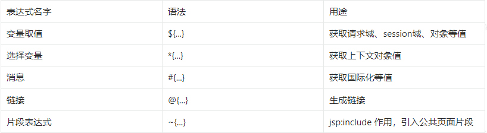
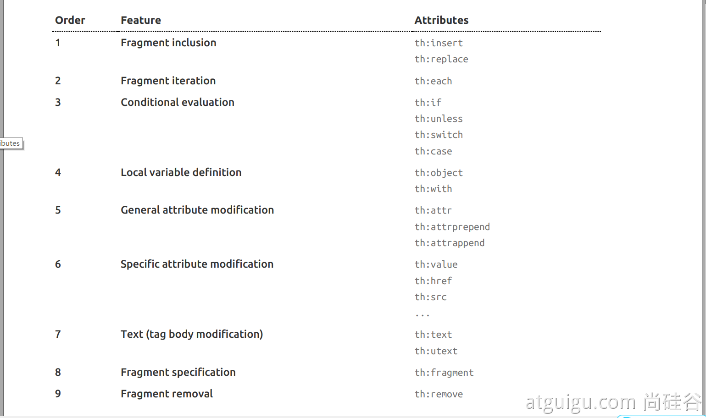

# 一、简介

性能低，不适合作为高并发使用
功能简单，适用于小网页和前后端分离技术

# 二、基本语法

## 2.1 表达式



## 2.2 字面量

文本值: 'one text' , 'Another one!' ,…
数字: 0 , 34 , 3.0 , 12.3 ,…
布尔值: true , false
空值: null
变量： one，two，.... 变量不能有空格

## 2.3 文本操作

字符串拼接: +
变量替换: |The name is ${name}| 

## 2.4 数学运算

运算符: + , - , * , / , %

## 2.5 布尔运算

运算符:  and , or
一元运算: ! , not 

## 2.6 比较运算

比较: > , < , >= , <= ( gt , lt , ge , le )等式: == , != ( eq , ne ) 

## 2.7 条件运算

If-then: (if) ? (then)
If-then-else: (if) ? (then) : (else)
Default: (value) ?: (defaultvalue) 

## 2.8 特殊操作

无操作： _

## 2.9 设置属性

``` html
<!-- th:attr -->
<!-- 单个值 -->
<form action="subscribe.html" th:attr="action=@{/subscribe}">
  <fieldset>
    <input type="text" name="email" />
    <input type="submit" value="Subscribe!" th:attr="value=#{subscribe.submit}"/>
  </fieldset>
</form>
<!-- 多个值 -->


<!-- th:xxxx -->
<input type="submit" value="Subscribe!" th:value="#{subscribe.submit}"/>
<form action="subscribe.html" th:action="@{/subscribe}">
```

## 2.10 迭代

``` html
<tr th:each="prod,iterStat : ${prods}" th:class="${iterStat.odd}? 'odd'">
  <td th:text="${prod.name}">Onions</td>
  <td th:text="${prod.price}">2.41</td>
  <td th:text="${prod.inStock}? #{true} : #{false}">yes</td>
</tr>
```

## 2.11 条件运算

``` html
<!-- if -->
<a href="comments.html"
th:href="@{/product/comments(prodId=${prod.id})}"
th:if="${not #lists.isEmpty(prod.comments)}">view</a>

<!-- swith -->
<div th:switch="${user.role}">
  <p th:case="'admin'">User is an administrator</p>
  <p th:case="#{roles.manager}">User is a manager</p>
  <p th:case="*">User is some other thing</p>
</div>
```

## 2.12 属性优先级




# 参考文献

[官方文档](https://www.thymeleaf.org/doc/tutorials/3.1/usingthymeleaf.html)