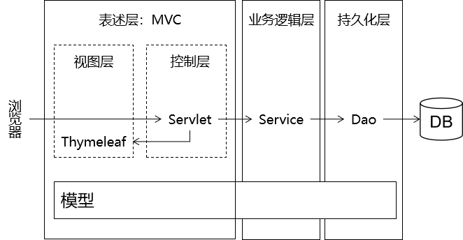
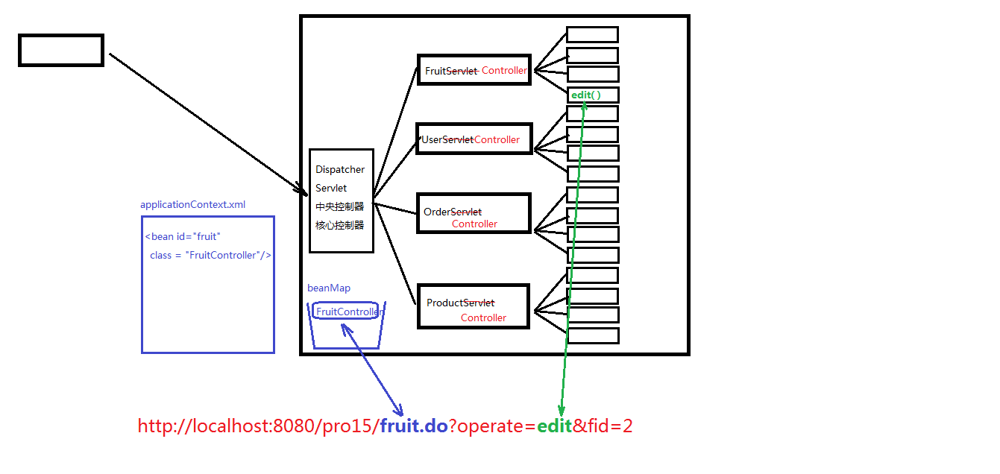
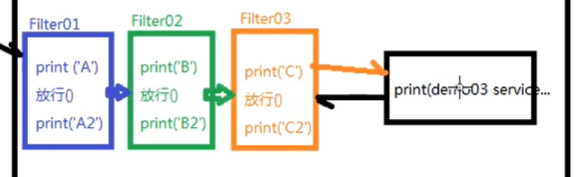
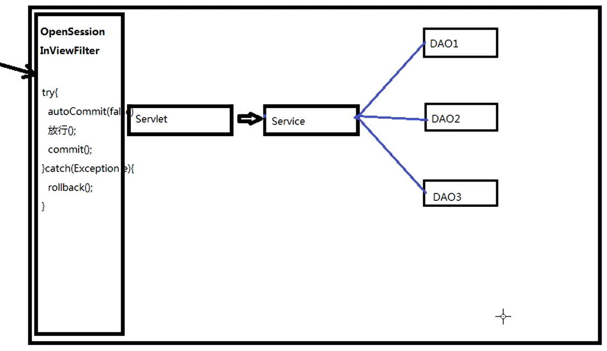
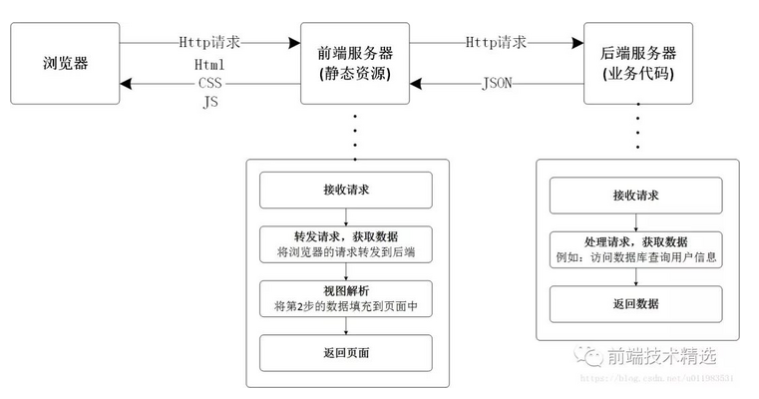
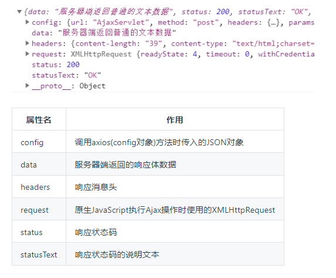

# 一、MVC概念

M：Model模型，模型分为很多种：有比较简单的pojo/vo(value object)，有业务模型组件，有数据访问层组件。

V：View视图，用于做数据展示以及和用户交互的一个界面。

C：Controller控制器，能够接受客户端的请求，具体的业务功能还是需要借助于模型组件来完成。

MVC是在表述层开发中运用的一种设计理念。主张把封装数据的『模型』、显示用户界面的『视图』、协调调度的『控制器』分开。

**MVC和三层架构之间关系**



# 二、Controller控制器

打包了之前Servlet重复的代码和通用的方法方便调用

一个控制器的执行分为两大部分：

1. 根据url定位到能够处理这个请求的controller组件
2. 调用Controller组件中的方法：

## 2.1 定位controller组件

1. 从url中提取servletPath
2. 根据servletPath找到对应的组件:servletPathController ， 这个对应的依据我们存储在applicationContext.xml中。通过DOM技术我们去解析XML文件，在中央控制器中形成一个beanMap容器，用来存放所有的Controller组件
``` xml
<bean id="servletPath" class="com.atguigu.servletPath.controllers.servletPathController/>
```
3. 根据获取到的operate的值定位到我们FruitController中需要调用的方法

## 2.2 调用Controller组件中的方法

1. **获取参数**:
   1. 获取即将要调用的方法的参数签名信息: Parameter[] parameters = method.getParameters();
   2. 通过parameter.getName()获取参数的名称；
   3. 准备了Object[] parameterValues 这个数组用来存放对应参数的参数值
   4. 另外，需要考虑参数的类型问题，需要做类型转化的工作。通过parameter.getType()获取参数的类型
2. **执行方法**:Object returnObj = method.invoke(controllerBean , parameterValues);
3. **视图处理**:
   ``` java
    String returnStr = (String)returnObj;
    if(returnStr.startWith("redirect:")){
        ...
    }else if{
        ...
    }
    ```

## 2.3 总体视图

**示例**：



# 三、Model模型

## 3.1 pojo/vo : 值对象

## 3.2 DAO ： 数据访问对象

DAO中的方法都是单精度方法或者称之为细粒度方法。什么叫单精度？一个方法只考虑一个操作，比如添加，那就是insert操作、查询那就是select操作....

## 3.3 BO ： 业务对象

BO中的方法属于业务方法，也实际的业务是比较复杂的，因此业务方法的粒度是比较粗的
注册这个功能属于业务功能，也就是说注册这个方法属于业务方法。
那么这个业务方法中包含了多个DAO方法。也就是说注册这个业务功能需要通过多个DAO方法的组合调用，从而完成注册功能的开发。
**注册**：

      1. 检查用户名是否已经被注册 - DAO中的select操作
      2. 向用户表新增一条新用户记录 - DAO中的insert操作
      3. 向用户积分表新增一条记录（新用户默认初始化积分100分） - DAO中的insert操作
      4. 向系统消息表新增一条记录（某某某新用户注册了，需要根据通讯录信息向他的联系人推送消息） - DAO中的insert操作
      5. 向系统日志表新增一条记录（某用户在某IP在某年某月某日某时某分某秒某毫秒注册） - DAO中的insert操作
      6. ....


# 四、View-视图

用视图模板技术构造视图

具体查看[Thymeleaf](Thymeleaf.md)

# 五、IOC-控制反转

具体查看[Spring5](Spring5.md)

## 5.1 IOC-控制反转

创建一个容器通过XML解析把模块装入容器中.控制权从程序员手中转移到BeanFactory。

## 5.2 DI-依赖注入

首先解析xml文件然后利用反射强制注入依赖。

# 六、Filter-过滤器

过滤请求。

属于Servlet规。

## 6.1 开发步骤

1. 新建类实现Filter接口，然后实现其中的三个方法：init、doFilter、destroy
2. 配置Filter，可以用注解@WebFilter，例如 @WebFilter("*.do")表示拦截所有以.do结尾的请求。也可以使用xml文件 
``` xml
<filter>
<filter-mapping> 
```

## 6.2 过滤器链



执行的顺序依次是： A B C demo03 C2 B2 A2

如果采取的是注解的方式进行配置，那么过滤器链的拦截顺序是按照全类名的先后顺序排序的

如果采取的是xml的方式进行配置，那么按照配置的先后顺序进行排序

# 七、事务管理

整体上可以用在事务控制上应用过滤器来实现。



DAO的内部使用ThreadLocal来实现

# 八、ThreadLocal-本地线程

http对应一个线程

可以通过set方法在当前线程上存储数据、通过get方法在当前线程上获取数据

1. get()
2. set(obj)

# 九、Listener-监听器

## 9.1 常用监听器

    1) ServletContextListener - 监听ServletContext对象的创建和销毁的过程
    2) HttpSessionListener - 监听HttpSession对象的创建和销毁的过程
    3) ServletRequestListener - 监听ServletRequest对象的创建和销毁的过程

    4) ServletContextAttributeListener - 监听ServletContext的保存作用域的改动(add,remove,replace)
    5) HttpSessionAttributeListener - 监听HttpSession的保存作用域的改动(add,remove,replace)
    6) ServletRequestAttributeListener - 监听ServletRequest的保存作用域的改动(add,remove,replace)

    7) HttpSessionBindingListener - 监听某个对象在Session域中的创建与移除
    8) HttpSessionActivationListener - 监听某个对象在Session域中的序列化和反序列化

# 十、cookie

# 10.1 本质

* 在浏览器端临时存储数据
* 键值对
* 键和值都是字符串类型
* 数据量很小

# 10.2 cookie在浏览器和服务器之间的传递

1. 没有Cookie的状态
2. 创建Cookie对象并返回
3. 服务器端返回Cookie的响应消息头
4. 浏览器拿到Cookie之后，以后的每一个请求都会携带Cookie信息。
5. 服务器端读取Cookie的信息

## 10.3 Cookie时效性

* 会话级cookie
  * 服务器端并没有明确指定Cookie的存在时间
  * 在浏览器端，Cookie数据存在于内存中
  * 只要浏览器还开着，Cookie数据就一直都在
  * 浏览器关闭，内存中的Cookie数据就会被释放

* 持久化Cookie
  * 服务器端明确设置了Cookie的存在时间
  * 在浏览器端，Cookie数据会被保存到硬盘上
  * Cookie在硬盘上存在的时间根据服务器端限定的时间来管控，不受浏览器关闭的影响
  * 持久化Cookie到达了预设的时间会被释放

## 10.4 Cookie的domain和path

上网时间长了，本地会保存很多Cookie。对浏览器来说，访问互联网资源时不能每次都把所有Cookie带上。浏览器会使用Cookie的domain和path属性值来和当前访问的地址进行比较，从而决定是否携带这个Cookie。

# 十一、前后端分离的开发模式

文章链接：https://segmentfault.com/a/1190000039765982

## 11.1 目的

减轻服务器压力，使前后端开发人员分离，专人专事。

## 11.2 核心思想

前端 Html 页面通过 Ajax 调用后端的 RestFul API 并使用 Json 数据进行交互。

## 11.3 从MVC到前后端分离

REST技术可以做到输入的是 AJAX 请求，输出的是 JSON 数据。

前后端分离的架构




# 十二、 Axios

使用原生的JavaScript程序执行Ajax极其繁琐，所以一定要使用框架来完成。而Axios就是目前最流行的前端Ajax框架。

官网：http://www.axios-js.com/

## 12.1 Ajax

前后端分离的开发模式中数据全部通过Ajax方式以JSON格式来传递。

Ajax(Asynchronous JavaScript And XML)指的是：不刷新浏览器窗口，不做页面跳转，局部更新页面内容的技术。

### 12.2 axios程序接收到的响应对象结构



# 参考文献

[尚硅谷2022JavaWeb](https://heavy_code_industry.gitee.io/code_heavy_industry/pro001-javaweb/lecture/)
