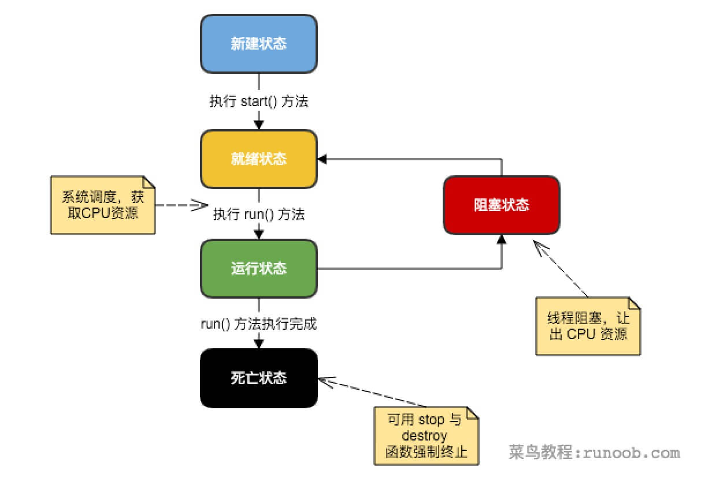

# 数据结构

## 枚举(Enumeration)

元素一个一个列举出来

## 位集合(Bitset)

特殊的数组

## 向量(Vector)

动态数组

## 栈(Stack)
## 字典(Dictionary)

* 哈希表(Hashtable)
* 属性(Properties)

# 集合框架

把常用的数据结构打包，位于java.util包。


**集合框架体系**


## ArrayList

可以动态修改的数组

``` Java
ArrayList<E> objectName =new ArrayList<>();
```

## LinkedList

链表

``` Java
LinkedList<E> list = new LinkedList<E>();   // 普通创建方法
或者
LinkedList<E> list = new LinkedList(Collection<? extends E> c); // 使用集合创建链表
```

## HashMap

散列表

``` java
HashMap<Integer, String> Sites = new HashMap<Integer, String>();
```

## HashSet

基于 HashMap，不允许有重复元素。

``` java
HashSet<String> sites = new HashSet<String>();
```

## 迭代器(Iterator)

可用于迭代ArrayList和HashSet等集合。


## Object

所有类的父类

# 泛型

可以处理不同类型的参数。

E - Element (在集合中使用，因为集合中存放的是元素)
T - Type（Java 类）
K - Key（键）
V - Value（值）
N - Number（数值类型）
？ - 表示不确定的 java 类型

# 序列化

打包一个对象的特征信息。

Object(Input/Output)Stream类中包含序列化和反序列化的方法。

可以序列化的类必须实现java.io.Serializable接口；非短暂属性是可序列化的。

# 网络编程

java.net包：TCP、UDP。

## Socket

TCP链接

客户端和服务器建立连接时服务器会创建一个Socket对象，两者通过对Socket对象读写进行通信。

### 过程

1. 服务器实例化一个 ServerSocket 对象，表示通过服务器上的端口通信。

2. 服务器调用 ServerSocket 类的 accept() 方法，该方法将一直等待，直到客户端连接到服务器上给定的端口。

3. 服务器正在等待时，一个客户端实例化一个 Socket 对象，指定服务器名称和端口号来请求连接。

4. Socket 类的构造函数试图将客户端连接到指定的服务器和端口号。如果通信被建立，则在客户端创建一个 Socket 对象能够与服务器进行通信。

5. 在服务器端，accept() 方法返回服务器上一个新的 socket 引用，该 socket 连接到客户端的 socket。

## URL处理

``` java
import java.net.*;
import java.io.*;
 
public class URLDemo
{
   public static void main(String [] args)
   {
      try
      {
         URL url = new URL("http://www.runoob.com/index.html?language=cn#j2se");
         System.out.println("URL 为：" + url.toString());
         System.out.println("协议为：" + url.getProtocol());
         System.out.println("验证信息：" + url.getAuthority());
         System.out.println("文件名及请求参数：" + url.getFile());
         System.out.println("主机名：" + url.getHost());
         System.out.println("路径：" + url.getPath());
         System.out.println("端口：" + url.getPort());
         System.out.println("默认端口：" + url.getDefaultPort());
         System.out.println("请求参数：" + url.getQuery());
         System.out.println("定位位置：" + url.getRef());
      }catch(IOException e)
      {
         e.printStackTrace();
      }
   }
}
```

输出：
>URL 为：http://www.runoob.com/index.html?language=cn#j2se
协议为：http
验证信息：www.runoob.com
文件名及请求参数：/index.html?language=cn
主机名：www.runoob.com
路径：/index.html
端口：-1
默认端口：80
请求参数：language=cn
定位位置：j2se


# 多线程

## 一个线程生命周期



## 创建线程

### Runnable接口

``` java
class RunnableDemo implements Runnable {
   private Thread t;
   private String threadName;
   
   RunnableDemo( String name) {
      threadName = name;
      System.out.println("Creating " +  threadName );
   }
   
   public void run() {
      System.out.println("Running " +  threadName );
      try {
         for(int i = 4; i > 0; i--) {
            System.out.println("Thread: " + threadName + ", " + i);
            // 让线程睡眠一会
            Thread.sleep(50);
         }
      }catch (InterruptedException e) {
         System.out.println("Thread " +  threadName + " interrupted.");
      }
      System.out.println("Thread " +  threadName + " exiting.");
   }
   
   public void start () {
      System.out.println("Starting " +  threadName );
      if (t == null) {
         t = new Thread (this, threadName);
         t.start ();
      }
   }
}
 
public class TestThread {
 
   public static void main(String args[]) {
      RunnableDemo R1 = new RunnableDemo( "Thread-1");
      R1.start();
      
      RunnableDemo R2 = new RunnableDemo( "Thread-2");
      R2.start();
   }   
}
```

输出：
>Creating Thread-1
Starting Thread-1
Creating Thread-2
Starting Thread-2
Running Thread-1
Thread: Thread-1, 4
Running Thread-2
Thread: Thread-2, 4
Thread: Thread-1, 3
Thread: Thread-2, 3
Thread: Thread-1, 2
Thread: Thread-2, 2
Thread: Thread-1, 1
Thread: Thread-2, 1
Thread Thread-1 exiting.
Thread Thread-2 exiting.


### 继承Thread类

把实现Runnable改为继承Thread类。本质没有不同。

### Callable和Future

1. 创建 Callable 接口的实现类，并实现 call() 方法，该 call() 方法将作为线程执行体，并且有返回值。

2. 创建 Callable 实现类的实例，使用 FutureTask 类来包装 Callable 对象，该 FutureTask 对象封装了该 Callable 对象的 call() 方法的返回值。

3. 使用 FutureTask 对象作为 Thread 对象的 target 创建并启动新线程。

4. 调用 FutureTask 对象的 get() 方法来获得子线程执行结束后的返回值。

``` java
public class CallableThreadTest implements Callable<Integer> {
    public static void main(String[] args)  
    {  
        CallableThreadTest ctt = new CallableThreadTest();  
        FutureTask<Integer> ft = new FutureTask<>(ctt);  
        for(int i = 0;i < 100;i++)  
        {  
            System.out.println(Thread.currentThread().getName()+" 的循环变量i的值"+i);  
            if(i==20)  
            {  
                new Thread(ft,"有返回值的线程").start();  
            }  
        }  
        try  
        {  
            System.out.println("子线程的返回值："+ft.get());  
        } catch (InterruptedException e)  
        {  
            e.printStackTrace();  
        } catch (ExecutionException e)  
        {  
            e.printStackTrace();  
        }  
  
    }
    @Override  
    public Integer call() throws Exception  
    {  
        int i = 0;  
        for(;i<100;i++)  
        {  
            System.out.println(Thread.currentThread().getName()+" "+i);  
        }  
        return i;  
    }  
}
```

## 三者区别

1. 采用实现 Runnable、Callable 接口的方式创建多线程时，线程类只是实现了 Runnable 接口或 Callable 接口，还可以继承其他类。

2. 使用继承 Thread 类的方式创建多线程时，编写简单，如果需要访问当前线程，则无需使用 Thread.currentThread() 方法，直接使用 this 即可获得当前线程。

# 反射

## 目的

解决在运行期，黑箱调用实例中的方法。

## 实现

通过class实例获取class信息。

## 动态加载

只有用的时候才会加载class

## 访问字段

例：修改字段值

``` java
public class Main {

    public static void main(String[] args) throws Exception {
        Person p = new Person("Xiao Ming");
        System.out.println(p.getName()); // "Xiao Ming"
        Class c = p.getClass();
        Field f = c.getDeclaredField("name");
        f.setAccessible(true);  // 别管这个字段是不是public，一律允许访问。可能会失败。
        f.set(p, "Xiao Hong");
        System.out.println(p.getName()); // "Xiao Hong"
    }
}

class Person {
    private String name;

    public Person(String name) {
        this.name = name;
    }

    public String getName() {
        return this.name;
    }
}

```

## 调用方法

通过Class实例的方法可以获取Method实例：getMethod()，getMethods()，getDeclaredMethod()，getDeclaredMethods()；

通过Method实例可以获取方法信息：getName()，getReturnType()，getParameterTypes()，getModifiers()；

通过Method实例可以调用某个对象的方法：Object invoke(Object instance, Object... parameters)；

同样可以使用setAccessible(true)调用private。

使用反射调用方法时，仍然遵循多态原则：即总是调用实际类型的覆写方法（如果存在）。

## 调用构造方法

通过Class实例的方法可以获取Constructor实例：getConstructor()，getConstructors()，getDeclaredConstructor()，getDeclaredConstructors()；

通过Constructor实例可以创建一个实例对象：newInstance(Object... parameters)； 通过设置setAccessible(true)来访问非public构造方法。

## 获取继承关系

通过Class对象可以获取继承关系：

Class getSuperclass()：获取父类类型；
Class[] getInterfaces()：获取当前类实现的所有接口。
通过Class对象的isAssignableFrom()方法可以判断一个向上转型是否可以实现。

## 动态代理

动态创建接口对象的方式

## 注

1. instanceof可以比较子类==不行。

# 注解

可以运行的备注

注解可以配置参数，没有指定配置的参数使用默认值；

如果参数名称是value，且只有一个参数，那么可以省略参数名称。

## 分类

分为三类：

第一类是由编译器使用的注解，例如：

* @Override：让编译器检查该方法是否正确地实现了覆写；
* @SuppressWarnings：告诉编译器忽略此处代码产生的警告。

第二类是由工具处理.class文件使用的注解。

第三类是在程序运行期能够读取的注解。

## 定义注解

@interface语法来定义注解,核心参数使用value名称
``` java
public @interface Report {
    int type() default 0;
    String level() default "info";
    String value() default "";
}
```

### 元注解

可以修饰其他注解

必须设置@Target和@Retention

#### @Target

定义注解能被用于哪些位置

* 类或接口：ElementType.TYPE；
* 字段：ElementType.FIELD；
* 方法：ElementType.METHOD；
* 构造方法：ElementType.CONSTRUCTOR；
* 方法参数：ElementType.PARAMETER。

``` java
@Target({
    ElementType.METHOD,
    ElementType.FIELD
})
public @interface Report {
    ...
}
```

#### @Retention

定义了Annotation的生命周期：

* 仅编译期：RetentionPolicy.SOURCE；
* 仅class文件：RetentionPolicy.CLASS；
* 运行期：RetentionPolicy.RUNTIME。
* 如果@Retention不存在，则该Annotation默认为CLASS。

#### @Inherited

定义子类是否可继承父类定义的Annotation。@Inherited仅针对@Target(ElementType.TYPE)类型的annotation有效，并且仅针对class的继承，对interface的继承无效

#### @Repeatable

定义Annotation重复

## 处理注解

### 读取

只讨论RUNTIME类型的注解，使用反射API

### 使用

编写程序使用，先读取再实现。

注：JUnit会自动运行@Test标记的测试方法。