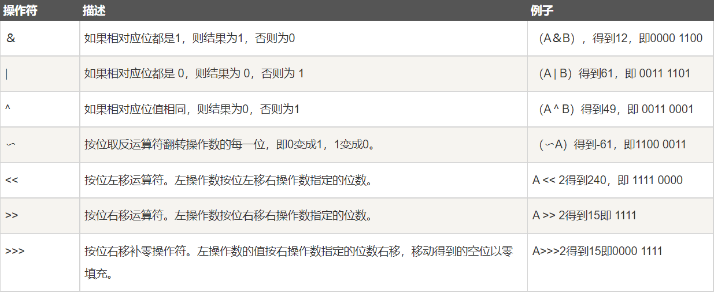

# 修饰符
* 访问修饰符
* 非访问修饰符
## 访问控制修饰符
### default(什么也不写)
同一包内可见。使用对象：类、接口、方法。
### private(私有)
同一类内可见。使用对象：变量、方法。
### public(公有)
所有类可见。使用对象：类、接口、方法。
### protected(受保护)
对同一包内的类和所有子类可见。使用对象：变量、方法。
* 子类与基类在同一包中：被声明为 protected 的变量、方法和构造器能被同一个包中的任何其他类访问；
* 子类与基类不在同一包中：那么在子类中，子类实例可以访问其从基类继承而来的 protected 方法，而不能访问基类实例的protected方法。

###
**总结**:private类自己；public所有的类；protected类自己和其子类。
**注**：父类为protected的方法在子类中不能声明为private，其余两个都可以。
## 非访问控制符
### static
声明独立于对象的静态变量(类变量)和静态方法
### final
最终
变量：被赋值后不能重新赋值。
方法：可以被继承但是不能被重写。
类：不能被继承。
### abstract
抽象
类：有抽象方法的类必须是抽象类。抽象类可以没有抽象方法。
方法：没有任何实现的方法，子类必须提供方法除非该子类也是抽象类。
### synchronized
方法同一时间只能被一个线程访问。
### transient
序列化的对象包含被 transient 修饰的实例变量时，java 虚拟机(JVM)跳过该特定的变量。
该修饰符包含在定义变量的语句中，用来预处理类和变量的数据类型。
### volatile
volatile 修饰的成员变量在每次被线程访问时，都强制从共享内存中重新读取该成员变量的值。而且，当成员变量发生变化时，会强制线程将变化值回写到共享内存。这样在任何时刻，两个不同的线程总是看到某个成员变量的同一个值。
一个 volatile 对象引用可能是 null。
# 运算符
## 位运算符
A = 60/0011 1100；B = 13/0000 1101

## 条件运算符(三元运算符)
variable x = (expression) **?** value if true **:** value if false
## instanceof
检查对象是否是一个特定类型，如果兼容仍然返回true。
# 循环
## Java增加for循环
用于数组循环条件为是否在数组中。
``` Java
for(声明语句 : 表达式){
    //代码句子
}
```