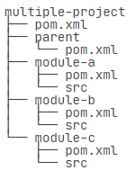
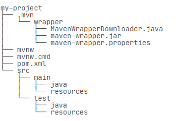
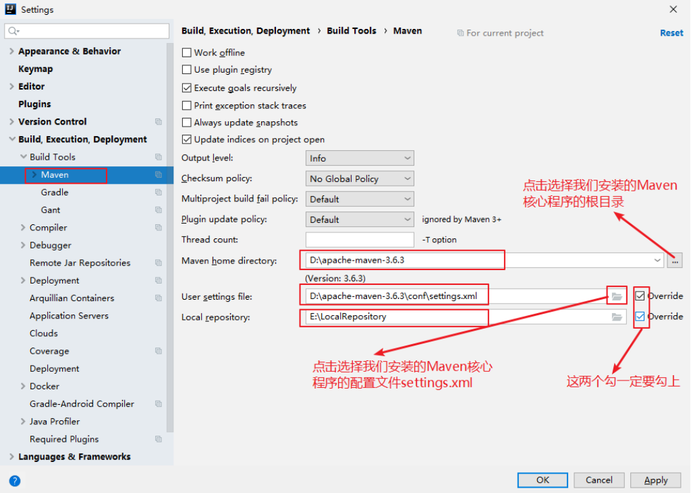

# 一、依赖管理

maven会自动导入父类依赖

一个jar包一旦被下载过，就会被Maven自动缓存在本地目录（用户主目录的.m2目录）

## 1.1 依赖关系

| scope | 说明 |
| ---- | ----|
| compeile | 编译时需要用到该jar包（默认） |
| test | 编译Test时需要用到该jar包 |
| runtime | 编译时不需要，但运行时需要用到 |
| provided | 编译时需要用到，但运行时由JDK或某个服务器提供 |

# 二、Lifecycle和Phase

**生命周期(Lifecycle):**

* validate 校验
* initialize 初始化
* generate-sources 生成源码
* process-sources 处理源码
* generate-resources 生成资源
* process-resources 处理资源
* compile 编译
* process-classes 处理-classes
* generate-test-sources 生成测试源码
* process-test-sources 处理测试源码
* generate-test-resources 生成测试资源
* process-test-resources 处理测试资源
* test-compile 测试编译
* process-test-classes 处理测试-classes
* test 测试
* prepare-package 准备打包
* package 打包
* pre-integration-test 预综合测试
* integration-test 综合测试
* post-integration-test 综合测试之后
* verify 核实
* install 安装
* deploy 部署

如果我们运行mvn compile，Maven也会执行default生命周期，但这次它只会运行到compile，即以下几个phase： 

* validate
* initialize
* generate-sources
* process-sources
* generate-resources
* process-resources
* compile

Maven另一个常用的生命周期是clean，它会执行3个phase：

* pre-clean
* clean （注意这个clean不是lifecycle而是phase）
* post-clean

更复杂的例子是指定多个phase，例如，运行mvn clean package，Maven先执行clean生命周期并运行到clean这个phase，然后执行default生命周期并运行到package这个phase，实际执行的phase如下：

* re-clean
* clean （注意这个clean是phase）
* validate
* ...
* package

几个常用的命令：

mvn clean：清理所有生成的class和jar
mvn clean *：先清理，再执行到 *；

# 三、插件

实际上，执行每个phase，都是通过某个插件（plugin）来执行的

常用的插件：

* maven-shade-plugin：打包所有依赖包并生成可执行jar；
* cobertura-maven-plugin：生成单元测试覆盖率报告；
* findbugs-maven-plugin：对Java源码进行静态分析以找出潜在问题。

# 四、模块管理

一个大项目可以分为多个模块



把共有的部分提取出作为parent。

**注**:parent的<packaging>是pom而不是jar，因为parent本身不含任何Java代码。

A、B、C都可以从parent继承

最后，在编译的时候，需要在根目录创建一个pom.xml统一编译：

``` xml
<project xmlns="http://maven.apache.org/POM/4.0.0"
    xmlns:xsi="http://www.w3.org/2001/XMLSchema-instance"
    xsi:schemaLocation="http://maven.apache.org/POM/4.0.0 http://maven.apache.org/maven-v4_0_0.xsd">

    <modelVersion>4.0.0</modelVersion>
    <groupId>com.itranswarp.learnjava</groupId>
    <artifactId>build</artifactId>
    <version>1.0</version>
    <packaging>pom</packaging>
    <name>build</name>

    <modules>
        <module>parent</module>
        <module>module-a</module>
        <module>module-b</module>
        <module>module-c</module>
    </modules>
</project>
```

# 五、mvnw

mvnw是Maven Wrapper的缩写。可以为某些项目指定独立的Maven版本。

## 5.1安装和运行Maven Wrapper

在项目的根目录（即pom.xml所在的目录）下运行安装命令：
``` xml
mvn -N io.takari:maven:0.7.6:wrapper -Dmaven=3.3.3
```

安装后的项目结构



只需要把mvn命令改成mvnw就可以使用跟项目关联的Maven。


# 六、在IDEA中使用Maven

## 6.1 配置自己安装的Maven

不同的项目配置不同的settings.xml



# 七、发布Artifact

发布自己写的开源库

(以后再说......)
