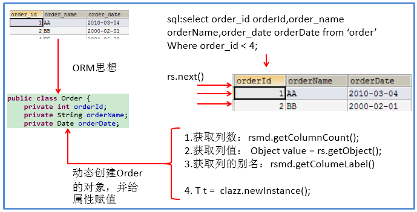
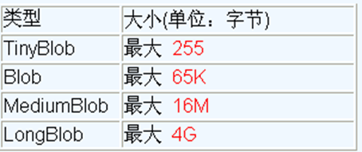

# 一、JDBC概述

Java Database Connectivity 服务端操作数据库的接口。

## 1.1体系结构


## 1.2编写步骤


# 二、连接数据库

## 2.1过程

``` java
@Test
public  void testConnection5() throws Exception {
    //1.加载配置文件
    InputStream is = ConnectionTest.class.getClassLoader().getResourceAsStream("jdbc.properties");
    Properties pros = new Properties();
    pros.load(is);
    
    //2.读取配置信息
    String user = pros.getProperty("user");
    String password = pros.getProperty("password");
    String url = pros.getProperty("url");
    String driverClass = pros.getProperty("driverClass");

    //3.加载驱动
    Class.forName(driverClass);

    //Driver driver = (Driver) clazz.newInstance();

    //3.1 注册驱动
    //DriverManager.registerDriver(driver);
    /*
    可以注释掉上述代码的原因，是因为在mysql的Driver类中声明有：
    static {
        try {
            DriverManager.registerDriver(new Driver());
        } catch (SQLException var1) {
            throw new RuntimeException("Can't register driver!");
        }
    }

    */

    //4.获取连接
    Connection conn = DriverManager.getConnection(url,user,password);
    System.out.println(conn);

}
```

# 三、实现CRUD操作

在 java.sql 包中有 3 个接口分别定义了对数据库的调用的不同方式：

* Statement：用于执行静态 SQL 语句并返回它所生成结果的对象。
  
* PrepatedStatement：SQL 语句被预编译并存储在此对象中，可以使用此对象多次高效地执行该语句。
  
* CallableStatement：用于执行 SQL 存储过程


由于Statemen存在SQL注入的问题所以使用PreparedStatement

## 3.1使用PreparedStatement

SQL语句中的参数用" ? "表示

### 3.1.1增删改

``` java
//通用的增、删、改操作（体现一：增、删、改 ； 体现二：针对于不同的表）
public void update(String sql,Object ... args){
    Connection conn = null;
    PreparedStatement ps = null;
    try {
        //1.获取数据库的连接
        conn = JDBCUtils.getConnection();
        
        //2.获取PreparedStatement的实例 (或：预编译sql语句)
        ps = conn.prepareStatement(sql);
        //3.填充占位符
        for(int i = 0;i < args.length;i++){
            ps.setObject(i + 1, args[i]);
        }
        
        //4.执行sql语句
        ps.execute();
    } catch (Exception e) {
        
        e.printStackTrace();
    }finally{
        //5.关闭资源
        JDBCUtils.closeResource(conn, ps);
        
    }
}
```

### 3.1.2查

``` java
// 通用的针对于不同表的查询:返回一个对象 (version 1.0)
public <T> T getInstance(Class<T> clazz, String sql, Object... args) {

    Connection conn = null;
    PreparedStatement ps = null;
    ResultSet rs = null;
    try {
        // 1.获取数据库连接
        conn = JDBCUtils.getConnection();

        // 2.预编译sql语句，得到PreparedStatement对象
        ps = conn.prepareStatement(sql);

        // 3.填充占位符
        for (int i = 0; i < args.length; i++) {
            ps.setObject(i + 1, args[i]);
        }

        // 4.执行executeQuery(),得到结果集：ResultSet
        rs = ps.executeQuery();

        // 5.得到结果集的元数据：ResultSetMetaData
        ResultSetMetaData rsmd = rs.getMetaData();

        // 6.1通过ResultSetMetaData得到columnCount,columnLabel；通过ResultSet得到列值
        int columnCount = rsmd.getColumnCount();
        if (rs.next()) {
            T t = clazz.newInstance();
            for (int i = 0; i < columnCount; i++) {// 遍历每一个列

                // 获取列值
                Object columnVal = rs.getObject(i + 1);
                // 获取列的别名:列的别名，使用类的属性名充当
                String columnLabel = rsmd.getColumnLabel(i + 1);
                // 6.2使用反射，给对象的相应属性赋值
                Field field = clazz.getDeclaredField(columnLabel);
                field.setAccessible(true);
                field.set(t, columnVal);

            }

            return t;

        }
    } catch (Exception e) {

        e.printStackTrace();
    } finally {
        // 7.关闭资源
        JDBCUtils.closeResource(conn, ps, rs);
    }

    return null;

}
```

**ORM思想：**



# 四、操作BLOB类型字段

## 4.1 MySQL BLOB

BLOB类型：二进制大数据。



## 4.2插入

ps.setBlob(?,FileInputStream);

## 4.3查询


首先从数据库中读取：Blob photo = rs.getBlob(5);

然后用流读取：

``` java
InputStream is = photo.getBinaryStream();
OutputStream os = new FileOutputStream("c.jpg");
byte [] buffer = new byte[1024];
int len = 0;
while((len = is.read(buffer)) != -1){
  os.write(buffer, 0, len);
}
```

# 五、批量插入

## 5.1批量执行SQL语句

可以采用java的批量更新机制

主要是以下三个方法：

* addBatch(String)：添加需要批量处理的SQL语句或是参数；

* executeBatch()：执行批量处理语句；

* clearBatch():清空缓存的数据

``` java
/* 使用 addBatch() / executeBatch() / clearBatch()
 * mysql服务器默认是关闭批处理的，我们需要通过一个参数，让mysql开启批处理的支持。?rewriteBatchedStatements=true 写在配置文件的url后面
 * 使用更新的mysql 驱动：mysql-connector-java-5.1.37-bin.jar
 */
@Test
public void testInsert2() throws Exception{
    long start = System.currentTimeMillis();
        
    Connection conn = JDBCUtils.getConnection();
        
    //1.设置为不自动提交数据
    conn.setAutoCommit(false);
        
    String sql = "insert into goods(name)values(?)";
    PreparedStatement ps = conn.prepareStatement(sql);
        
    for(int i = 1;i <= 1000000;i++){
        ps.setString(1, "name_" + i);
            
        //1.“攒”sql
        ps.addBatch();
            
        if(i % 500 == 0){
            //2.执行
            ps.executeBatch();
            //3.清空
            ps.clearBatch();
        }
    }
        
    //2.提交数据
    conn.commit();
        
    long end = System.currentTimeMillis();
    System.out.println("花费的时间为：" + (end - start));//1000000条:4978 
        
    JDBCUtils.closeResource(conn, ps);
}
```
# 六、数据库事务