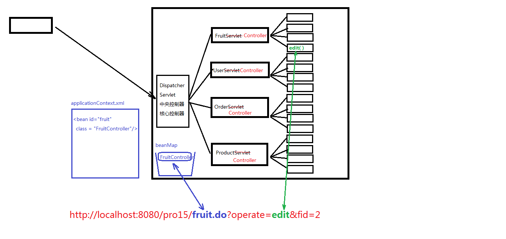
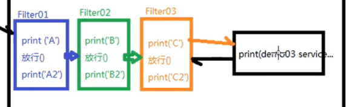
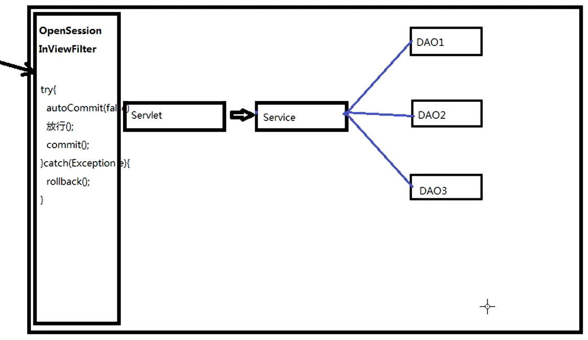

# 一、概念

M：Model模型，模型分为很多种：有比较简单的pojo/vo(value object)，有业务模型组件，有数据访问层组件。

V：View视图，用于做数据展示以及和用户交互的一个界面。

C：Controller控制器，能够接受客户端的请求，具体的业务功能还是需要借助于模型组件来完成。

MVC是在表述层开发中运用的一种设计理念。主张把封装数据的『模型』、显示用户界面的『视图』、协调调度的『控制器』分开。

**MVC和三层架构之间关系**


# 二、Controller控制器

打包了之前Servlet重复的代码和通用的方法方便调用

一个控制器的执行分为两大部分：

1. 根据url定位到能够处理这个请求的controller组件
2. 调用Controller组件中的方法：

## 2.1 定位controller组件

1. 从url中提取servletPath
2. 根据servletPath找到对应的组件:servletPathController ， 这个对应的依据我们存储在applicationContext.xml中。通过DOM技术我们去解析XML文件，在中央控制器中形成一个beanMap容器，用来存放所有的Controller组件
``` xml
<bean id="servletPath" class="com.atguigu.servletPath.controllers.servletPathController/>
```
3. 根据获取到的operate的值定位到我们FruitController中需要调用的方法

## 2.2 调用Controller组件中的方法

1. **获取参数**:
   1. 获取即将要调用的方法的参数签名信息: Parameter[] parameters = method.getParameters();
   2. 通过parameter.getName()获取参数的名称；
   3. 准备了Object[] parameterValues 这个数组用来存放对应参数的参数值
   4. 另外，需要考虑参数的类型问题，需要做类型转化的工作。通过parameter.getType()获取参数的类型
2. **执行方法**:Object returnObj = method.invoke(controllerBean , parameterValues);
3. **视图处理**:
   ``` java
    String returnStr = (String)returnObj;
    if(returnStr.startWith("redirect:")){
        ...
    }else if{
        ...
    }
    ```

## 2.3 总体视图

**示例**：



# 三、Model模型

## 3.1 pojo/vo : 值对象

## 3.2 DAO ： 数据访问对象

DAO中的方法都是单精度方法或者称之为细粒度方法。什么叫单精度？一个方法只考虑一个操作，比如添加，那就是insert操作、查询那就是select操作....

## 3.3 BO ： 业务对象

BO中的方法属于业务方法，也实际的业务是比较复杂的，因此业务方法的粒度是比较粗的
注册这个功能属于业务功能，也就是说注册这个方法属于业务方法。
那么这个业务方法中包含了多个DAO方法。也就是说注册这个业务功能需要通过多个DAO方法的组合调用，从而完成注册功能的开发。
**注册**：

      1. 检查用户名是否已经被注册 - DAO中的select操作
      2. 向用户表新增一条新用户记录 - DAO中的insert操作
      3. 向用户积分表新增一条记录（新用户默认初始化积分100分） - DAO中的insert操作
      4. 向系统消息表新增一条记录（某某某新用户注册了，需要根据通讯录信息向他的联系人推送消息） - DAO中的insert操作
      5. 向系统日志表新增一条记录（某用户在某IP在某年某月某日某时某分某秒某毫秒注册） - DAO中的insert操作
      6. ....


# 四、View-视图

用视图模板技术构造视图

[Thymeleaf](Java\企业开发\基础\Thymeleaf.md)

# 五、IOC-控制反转

## 5.1 IOC-控制反转

创建一个容器通过XML解析把模块装入容器中.控制权从程序员手中转移到BeanFactory。

## 5.2 DI-依赖注入

首先解析xml文件然后利用反射强制注入依赖。

# 六、Filter-过滤器

过滤请求。

属于Servlet规。

## 6.1 开发步骤

1. 新建类实现Filter接口，然后实现其中的三个方法：init、doFilter、destroy
2. 配置Filter，可以用注解@WebFilter，例如 @WebFilter("*.do")表示拦截所有以.do结尾的请求。也可以使用xml文件 
``` xml
<filter>
<filter-mapping> 
```

## 6.2 过滤器链



执行的顺序依次是： A B C demo03 C2 B2 A2

如果采取的是注解的方式进行配置，那么过滤器链的拦截顺序是按照全类名的先后顺序排序的

如果采取的是xml的方式进行配置，那么按照配置的先后顺序进行排序

# 七、事务管理

整体上可以用在事务控制上应用过滤器来实现。



DAO的内部使用ThreadLocal来实现

# 八、ThreadLocal-本地线程

http对应一个线程

可以通过set方法在当前线程上存储数据、通过get方法在当前线程上获取数据

1. get()
2. set(obj)

# 九、Listener-监听器