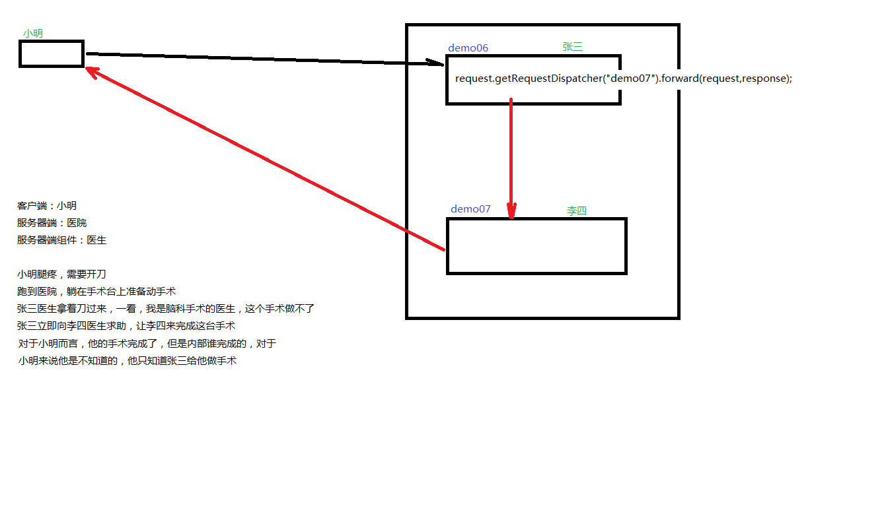
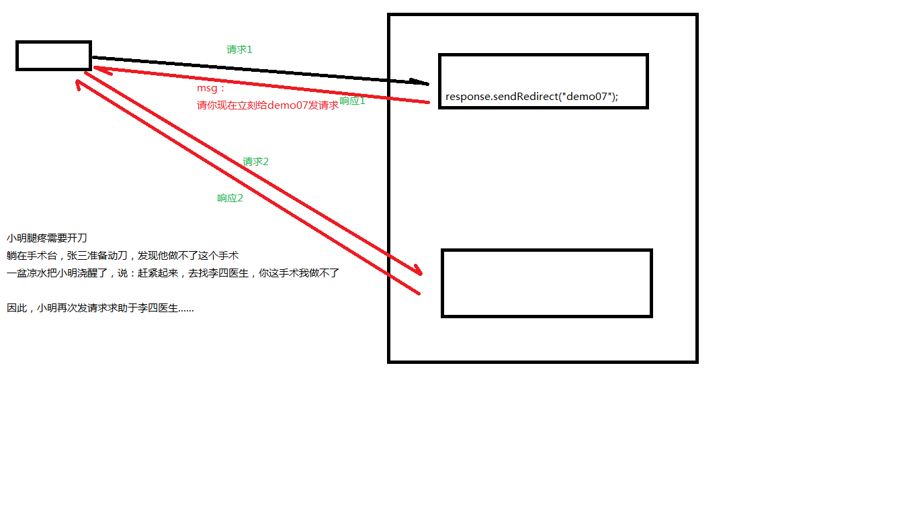

# 一、概述

## 1.1 功能

处理请求，协调调度。

# 二、继承关系-service()方法

1. 继承关系： HttpServlet -> GenericServlet -> Servlet
2. Servlet中的核心方法： init() , service() , destroy()
3. 服务方法： 当有请求过来时，service方法会自动响应（其实是tomcat容器调用的）
   1. 在HttpServlet中我们会去分析请求的方式：到底是get、post、head还是delete等等
   2. 然后再决定调用的是哪个do开头的方法
   3. 那么在HttpServlet中这些do方法默认都是405的实现风格-要我们子类去实现对应的方法，否则默认会报405错误
4. 因此，我们在新建Servlet时，我们才会去考虑请求方法，从而决定重写哪个do方法

# 三、生命周期

初始化，运行和销毁。对应Servlet中的三个方法：init(),service(),destroy()

##  3.1过程

默认第一次接收请求时，这个Servlet会进行实例化(调用构造方法)、初始化(调用init())、然后服务(调用service())。可以通过<load-on-startup>来设置servlet启动的先后顺序,数字越小，启动越靠前，最小值0。

从第二次请求开始，每一次都是服务

当容器关闭时，其中的所有的servlet实例会被销毁，调用销毁方法

Servlet在容器中是：单例的、线程不安全的

尽量的不要在servlet中定义成员变量。如果不得不定义成员变量，那么不要去：
1. 不要去修改成员变量的值 
2. 不要去根据成员变量的值做一些逻辑判断

# 四、Http

## 4.1 请求：
请求包含三个部分： 1.请求行 ； 2.请求消息头 ； 3.请求主体
1. 请求行包含是三个信息： 1. 请求的方式 ； 2.请求的URL ； 3.请求的协议（一般都是HTTP1.1）
2. 请求消息头中包含了很多客户端需要告诉服务器的信息，比如：我的浏览器型号、版本、我能接收的内容的类型、我给你发的内容的类型、内容的长度等等
3. 请求体，三种情况
   1. get方式，没有请求体，但是有一个queryString
   2. post方式，有请求体，form data
   3. json格式，有请求体，request payload

## 4.2 响应：
响应也包含三部分： 1. 响应行 ； 2.响应头 ； 3.响应体
1. 响应行包含三个信息：1.协议 2.响应状态码(200) 3.响应状态(ok)
2. 响应头：包含了服务器的信息；服务器发送给浏览器的信息（内容的媒体类型、编码、内容长度等）
3. 响应体：响应的实际内容（比如请求add.html页面时，响应的内容就是<html><head><body><form....）

# 五、会话(session)

## 5.1 目的
分辨请求来自哪个客户端

## 5.2实现原理

* 客户端第一次发请求给服务器，服务器获取session，获取不到，则创建新的，然后响应给客户端

* 下次客户端给服务器发请求时，会把sessionID带给服务器，那么服务器就能获取到了，那么服务器就判断这一次请求和上次某次请求是同一个客户端，从而能够区分开客户端

request.getSession() -> 获取当前的会话，没有则创建一个新的会话
request.getSession(true) -> 效果和不带参数相同
request.getSession(false) -> 获取当前会话，没有则返回null，不会创建新的

session.getId() -> 获取sessionID
session.isNew() -> 判断当前session是否是新的
session.getMaxInactiveInterval() -> session的非激活间隔时长，默认1800秒
session.setMaxInactiveInterval()
session.invalidate() -> 强制性让会话立即失效

## 5.3 session保存作用域

把session的数据保存在容器中的一个地方

每一个的session的数据是隔离的

### 5.3.3 常用API

void session.setAttribute(k,v)
Object session.getAttribute(k)
void removeAttribute(k)

# 六、服务器内部转发以及客户端重定向

## 6.1 服务器内部转发

服务器内把需求转给另一个内核

## 6.2客户端重定向

服务器把转发的动作交给客户端来做

# 七、Thymeleaf - 视图模板技术

Thymeleaf是一个模板引擎

## 7.1 模板引擎

目的是将显示与数据分离
