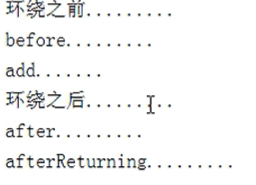

# 一、Spring概念

## 1.1 概述

1. Spring是轻量级的开源的JavaEE框架
2. Spring可以解决企业应用开发的复杂性
3. Spring有两个核心部分：IOC和Aop
   1. IOC：控制反转，把创建对象过程交给Spring进行管理
   2. Aop：面向切面，不修改源代码进行功能增强

## 1.2 特点

1. 方便解耦，简化开发，尽可能做到能不该源码就不改源码，把所有修改操作都在配置文件中修改。
2. Aop编程支持
3. 方便程序测试
4. 方便和其他框架进行整合
5. 方便进行事务操作
6. 降低API开发难度

# 二、IOC

## 2.1 概念和原理

IOC是控制反转，在此特指把对象创建和对象之间的调用过程，交给Spring进行管理。

**使用IOC目的**：为了耦合度降低

**IOC底层原理**：xml解析、工厂模式、反射

## 2.2 接口

IOC思想基于IOC容器完成，IOC容器底层就是对象工厂

### 2.2.1 BeanFactory

IOC容器基本实现，是Spring内部的使用接口，不提供开发人员进行使用

* 加载配置文件时候不会创建对象，在获取对象（使用）才去创建对象

### 2.2.2 ApplicationContext

BeanFactory接口的子接口，提供更多更强大的功能，一般由开发人员进行使用

* 加载配置文件时候就会把在配置文件对象进行创建

#### 2.2.2.1FileSystemXmlApplicationContext & ClassPathXmlApplicationContext

File对应的文件存放在其他地方，Class对应的文件存放在src文件夹下

## 2.3 Bean管理

Spring创建对象
Spirng注入属性

### 2.3.1 xml实现

#### 2.3.1.1 对象

在Spring配置文件中使用bean标签，标签里面添加对应属性，就可以实现对象创建。

常用属性：
* id属性：唯一标识
* class属性：类全路径（包类路径）

``` xml
<bean id="" class=""></bean>
```

#### 2.3.1.2 属性

1.set方法(注：p名称空间注入做出了简化)

``` xml
<bean id="" class="">
   <!-- 变量用value；
   
   类用ref， ref的值是bean中声明的id，可以使用内部bean和外部bean两种，赋值也有级联赋值技术。
   
   
   -->
   <property name="" value=""></property>

   <!-- 集合类型属性注入:
   还可以使用util
   array/list/map/set -->

   <!-- 使用contex命名空间引入外部文件 -->

   <property name="">
      <ArrayListSet>
         <value></value>
         <value></value>
      </ArrayListSet>
   </property>

   <property name="">
      <map>
         <entry key="" value=""></entry>
         <entry key="" value=""></entry>
      </map>
   </property>


</bean>
```

2.有参构造注入

``` xml
<bean id="" class="">
   <constructor-arg name="" value=""></constructor-arg>
</bean>
```


#### 2.3.1.3 工厂bean(FactoryBean)

spring有两种bean类型：

**普通bean**：在配置文件中定义bean类型就是返回类型

**工厂bean**：在配置文件定义bean类型可以和返回类型不一样
* 第一步 创建类，让这个类作为工厂bean，实现接口 FactoryBean
* 第二步 实现接口里面的方法，在实现的方法中定义返回的bean类型


#### 2.3.1.4 bean作用域

scope属性标明当前bean的作用域：
第一个值 默认值，singleton，表示是单实例对象
第二个值 prototype，表示是多实例对象

**singleton**：加载spring配置文件时候就会创建单实例对象
**prototype**：不是在加载spring配置文件时候创建 对象，在调用getBean方法时候创建多实例对象

#### 2.3.1.5 bean的生命周期

**无后置处理的bean**

1. 通过构造器创建bean实例（无参数构造）
2. 为bean的属性设置值和对其他bean引用（调用set方法）
3. 调用bean的初始化的方法（需要进行配置初始化的方法）
4. bean可以使用了（对象获取到了）
5. 当容器关闭时候，调用bean的销毁的方法（需要进行配置销毁的方法）

**bean的后置处理器**

1. 通过构造器创建bean实例（无参数构造）
1. 为bean的属性设置值和对其他bean引用（调用set方法） 
2. 把bean实例传递bean后置处理器的方法postProcessBeforeInitialization
3. 调用bean的初始化的方法（需要进行配置初始化的方法）
4. 把bean实例传递bean后置处理器的方法postProcessAfterInitialization
5. bean可以使用了（对象获取到了）
6. 当容器关闭时候，调用bean的销毁的方法（需要进行配置销毁的方法）


#### 2.3.1.6 自动装配

bean标签属性autowire，配置自动装配 autowire属性常用两个值： 
byName根据属性名称注入 ，注入值bean的id值和类属性名称一样 
byType根据属性类型注入

### 2.3.2 注解实现

在类上面，方法上面，属性上面；格式：@注解名称(属性名称=属性值, 属性名称=属性值..)。

#### 2.3.2.1 开启组件扫描

``` xml
<!--
默认
开启组件扫描 
1 如果扫描多个包，多个包使用逗号隔开 
2 扫描包上层目录 --> 
<context:component-scan base-package="com.jiao"></context:component-scan>

<!-- use-default-filters="false" 表示现在不使用默认filter，自己配置filter 
context:include-filter ，设置扫描哪些内容 --> 
<context:component-scan base-package="com.jiao" use-default-filters="false"> 
   <context:include-filter type="annotation" 

      expression="org.springframework.stereotype.Controller"/> 
</context:component-scan> 

<!-- 下面配置扫描包所有内容 
context:exclude-filter： 设置哪些内容不进行扫描 --> 
<context:component-scan base-package="com.jiao"> 
   <context:exclude-filter type="annotation" 

      expression="org.springframework.stereotype.Controller"/> 
</context:component-scan>
```

#### 2.3.2.2 创建对象

**@Component**：普通注解。
**@Service**：一般用在业务逻辑层。
**@Controller**：一般用在Web层。
**@Repository**：一般用在Dao层。

是一样的，都可以用，规范最好。value中的值可以不写，默认同名，首字母小写。

#### 2.3.2.3 属性注入

**@Autowired**：根据属性类型进行自动装配
**@Qualifier**：和@Autowired一起使用，根据名称进行注入
**@Resource**：可以根据类型注入，可以根据名称注入
**@Value**：注入普通类型属性

#### 2.3.2.4 完全注解开发

``` java 
@Configuration //作为配置类，替代xml配置文件 
@ComponentScan(basePackages = {"com.jiao"})
public class SpringConfig { 

}

// 测试写法
@Test 
public void testService2() { //加载配置类 
   ApplicationContext context 
      = new AnnotationConfigApplicationContext(SpringConfig.class); 

   UserService userService = context.getBean("userService", UserService.class); 
   System.out.println(userService); 
   userService.add(); 
}
```

# 三、AOP

Aspect Oriented Programming，即面向切面编程.利用AOP可以对业务逻辑的各个部分进行隔离.

## 3.1 底层原理

分两种情况
有接口——>JDK动态代理：创建接口实现类代理对象，增强类的方法
无接口——>CGLIB动态代理：创建子类的代理对象，增强类的方法

### 3.1.1 JDK动态代理

使用Proxy类里面的方法创建代理对象

调用newProxyInstance方法
   * 方法有三个参数：
   * 第一参数，类加载器；
   * 第二参数，增强方法所在的类，这个类实现的接口，支持多个接口；
   * 第三参数，实现这个接口InvocationHandler，创建代理对象，写增强的部分

## 3.2 操作术语

1. 连接点：可以被增强的方法
2. 切入点：被增强的方法
3. 通知(增强)：实际增强的逻辑部分
   1. 前置通知:被增强方法前
   2. 后置通知:被增强方法后
   3. 环绕通知:被增强方法前＋后
   4. 异常通知:被增强方法异常会执行
   5. 最终通知:无论如何都会执行
4. 切面：应用的过程
5. 引介:指为一个已有的Java对象动态地增加新的接口；
6. 织入:指将切面整合到程序的执行流程中；
7. 拦截器:是一种实现增强的方式；
8. 目标对象:即真正执行业务的核心逻辑对象；
9. AOP代理:是客户端持有的增强后的对象引用。

## 3.3 切入点表达式

切入点表达式作用：知道对哪个类里面的哪个方法进行增强

语法结构：``` execution([权限修饰符] [返回类型] [类全路径] [方法名称]([参数列表]) )```

举例1：对com.jiao.dao.BookDao类里面的add进行增强
execution(* com.jiao.dao.BookDao.add(..))

举例2：对com.jiao.dao.BookDao类里面的所有的方法进行增强
execution(* com.jiao.dao.BookDao.* (..))

举例3：对com.jiao.dao包里面所有类，类里面所有方法进行增强
execution(* com.jiao.dao.*.* (..))

## 3.4 AspectJ 注解

### 3.4.1 创建类，在类里面定义方法

### 3.4.2 创建增强类（编写增强逻辑）

### 3.4.3 进行通知的配置

1. 在spring配置文件中，开启注解扫描

2. 使用注解创建User和UserProxy对象
用@Component在对象上注解

3. 在增强类上面添加注解@Aspect 意味着生成代理对象。

4. 在spring配置文件中开启生成代理对象

### 3.4.4 配置不同类型的通知

在增强类的里面，在作为通知方法上面添加通知类型注解，使用切入点表达式配置

``` java
//前置通知
@Before(value = "execution(* com.jiao.spring5.aop.User.add(..))")
//后置通知（返回通知） 
@AfterReturning(value = "execution(* com.jiao.spring5.aop.User.add(..))")
//最终通知 
@After(value = "execution(* com.jiao.spring5.aop.User.add(..))")
//异常通知 
@AfterThrowing(value = "execution(* com.jiao.spring5.aop.User.add(..))")
//环绕通知 
@Around(value = "execution(* com.jiao.spring5.aop.User.add(..))")
```

执行顺序：



### 3.4.5 相同的切入点抽取

加入注解@Pointcut

``` java
@Pointcut(value = "execution(* com.jiao.spring5.aop.User.add(..))")
public void pointdemo() { 
} 
@Before(value = "pointdemo()") 
public void before() { 
   System.out.println("before........."); 
}
```

### 3.4.6 有多个增强类多同一个方法进行增强，设置增强类优先级

 在增强类上面添加注解 @Order(数字类型值)，数字类型值越小优先级越高

### 3.4.7 完全使用注解开发

创建配置类，不需要创建xml配置文件
``` java
@Configuration 
@ComponentScan(basePackages = {"com.jiao"}) 
@EnableAspectJAutoProxy(proxyTargetClass = true) 
public class ConfigAop { 
}
```

## 3.5 AspectJ配置文件

1. 创建两个类，增强类和被增强类，创建方法
2. 在spring配置文件中创建两个类对象
3. 在spring配置文件中配置切入点
   ``` xml
   <!--配置aop增强--> 
   <aop:config> 
      <!--切入点--> 
      <aop:pointcut id="p" expression="execution(* com.jiao.spring5.aopxml.Book.buy(..))"/> 
      <!--配置切面--> 
      <aop:aspect ref="bookProxy"> 
      <!--增强作用在具体的方法上--> 
      <aop:before method="before" pointcut-ref="p"/> </aop:aspect> </aop:config>
   ```


# 四、JdbcTemplate

Spring框架对JDBC进行封装，使用JdbcTemplate方便实现对数据库操作

## 4.1 准备工作

1. 在spring配置文件配置数据库连接池
2. 配置JdbcTemplate对象，注入DataSource
3. 创建service类，创建dao类，在dao注入jdbcTemplate对象


# 五、事务管理

# 六、Spring5新特性

# 参考文献

[**尚硅谷**](https://www.bilibili.com/video/BV1Vf4y127N5)
[**廖雪峰**](https://www.liaoxuefeng.com/wiki)