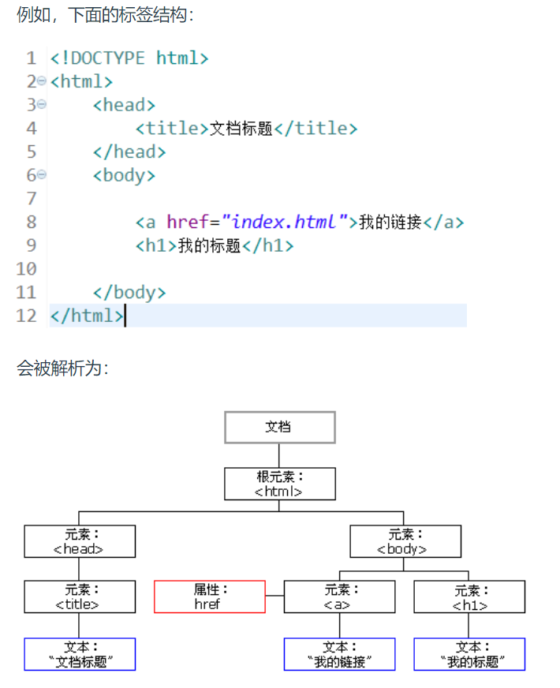

# 一、HTML
# 二、CSS
# 三、JavaScript

## 3.1 变量

声明：var 区分大小写
只有三种：数值，字符，布尔

## 3.2 函数

声明：function

## 3.3 对象

声明：var Objectname {};

## 3.4 DOM树

把html文件解析为一棵树

# 四、Vue.js

[**官方文档**](https://cn.vuejs.org/guide/introduction.html)

## 4.1 简介

