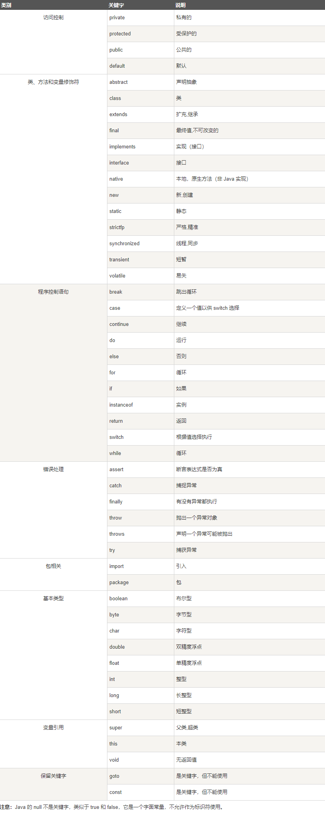

# 开始
## java关键字

## 数据类型
* byte
  * 8、补码整数
* short
  * 16、补码整数
* int
  * 32、补码整数
* long
  * 64、补码整数
  * 默认：0L
  * long a = 10000L
* float
  * 单精度、32、IEEE754
  * 默认：0.0f
  * float f1 = 224.5f
* double
  * 双精度、64、IEEE754
  * 默认0.0d
   ``` Java {.line-numbers} 
  double d1 = 7D;
  double d2 = 7.;
  double d3 = 7.0;
  double d4 = 7.D;
  double d5 = 5456.2454;
   ```
* boolean
  * true & false
  * 默认值： false
  * boolean b1 = true
* char
  * 16、Unicode字符
  * min: \u0000
  * max: \uffff
  * 默认：'u0000'
  * char letter = "A"
### 常量
关键字：final
尽量是用大写字母命名常量
#### 类型转换
``` java 
低  ------------------------------------>  高
byte,short,char—> int —> long—> float —> double
``` 
#### 规则
1. boolean不能转换
2. 不能转换为不相关
3. 容量大转小必须强制类型转换
4. 可能溢出损失精度
5. 浮点->整数通过舍弃小数
#### 自动类型转换
低转高
``` java {.line-numbers}
            char c1='a';//定义一个char类型
            int i1 = c1;//char自动类型转换为int
```
#### 强制类型转换
1. 必须兼容
2. 格式：(type)value type
3. 实例：
   ``` java {.line-numbers}
   int i1 = 123;
   byte b = (byte)i1;//强制转换为byte
   ``` 
### 变量
* 类变量：独立于方法之外的变量，用static修饰
* 实例变量：独立于方法之外的变量，不用static修饰
* 局部变量：类的方法中的变量
  ``` java {.line-numbers}
  public class Variable{
    static int allClicks=0;    // 类变量
 
    String str="hello world";  // 实例变量
 
    public void method(){
 
        int i =0;  // 局部变量
 
    }
  }
  ```
#### 类变量(静态变量)
* 类变量也称为静态变量，在类中以 static 关键字声明，但必须在方法之外。
* 无论一个类创建了多少个对象，类只拥有类变量的一份拷贝。
* 静态变量除了被声明为常量外很少使用，静态变量是指声明为 public/private，final 和 static 类型的变量。静态变量初始化后不可改变。
* 静态变量储存在静态存储区。经常被声明为常量，很少单独使用 static 声明变量。
* 静态变量在第一次被访问时创建，在程序结束时销毁。
* 与实例变量具有相似的可见性。但为了对类的使用者可见，大多数静态变量声明为 public 类型。
* 默认值和实例变量相似。数值型变量默认值是 0，布尔型默认值是 false，引用类型默认值是 null。变量的值可以在声明的时候指定，也可以在构造方法中指定。此外，静态变量还可以在静态语句块中初始化。
* 静态变量可以通过：ClassName.VariableName的方式访问。
* 类变量被声明为 public static final 类型时，类变量名称一般建议使用大写字母。如果静态变量不是 public 和 final 类型，其命名方式与实例变量以及局部变量的命名方式一致。
``` java {.line-numbers}
import java.io.*;
 
public class Employee {
    //salary是静态的私有变量
    private static double salary;
    // DEPARTMENT是一个常量
    public static final String DEPARTMENT = "开发人员";
    public static void main(String[] args){
    salary = 10000;
        System.out.println(DEPARTMENT+"平均工资:"+salary);
    }
}
```
#### 实例变量
* 在一个类中声明
* 实例变量声明在一个类中，但在方法、构造方法和语句块之外；
* 当一个对象被实例化之后，每个实例变量的值就跟着确定；
* 实例变量在对象创建的时候创建，在对象被销毁的时候销毁；
* 实例变量的值应该至少被一个方法、构造方法或者语句块引用，使得外部能够通过这些方式获取实例变量信息；
* 实例变量可以声明在使用前或者使用后；
* 访问修饰符可以修饰实例变量；
* 实例变量对于类中的方法、构造方法或者语句块是可见的。一般情况下应该把实例变量设为私有。通过使用访问修饰符可以使实例变量对子类可见；
* 实例变量具有默认值。数值型变量的默认值是0，布尔型变量的默认值是false，引用类型变量的默认值是null。变量的值可以在声明时指定，也可以在构造方法中指定；
* 实例变量可以直接通过变量名访问。但在静态方法以及其他类中，就应该使用完全限定名：ObjectReference.VariableName。
``` java {.line-numbers}
import java.io.*;
public class Employee{
   // 这个实例变量对子类可见
   public String name;
   // 私有变量，仅在该类可见
   private double salary;
   //在构造器中对name赋值
   public Employee (String empName){
      name = empName;
   }
   //设定salary的值
   public void setSalary(double empSal){
      salary = empSal;
   }  
   // 打印信息
   public void printEmp(){
      System.out.println("名字 : " + name );
      System.out.println("薪水 : " + salary);
   }
 
   public static void main(String[] args){
      Employee empOne = new Employee("RUNOOB");
      empOne.setSalary(1000.0);
      empOne.printEmp();
   }
}
```
#### 局部变量
* 局部变量没有默认值。
``` java {.line-numbers}
package com.runoob.test;
 
public class Test{ 
   public void pupAge(){
      int age = 0;
      age = age + 7;
      System.out.println("小狗的年龄是: " + age);
   }
   
   public static void main(String[] args){
      Test test = new Test();
      test.pupAge();
   }
}
```