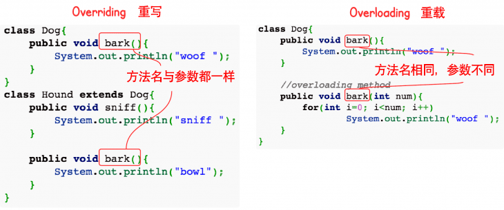
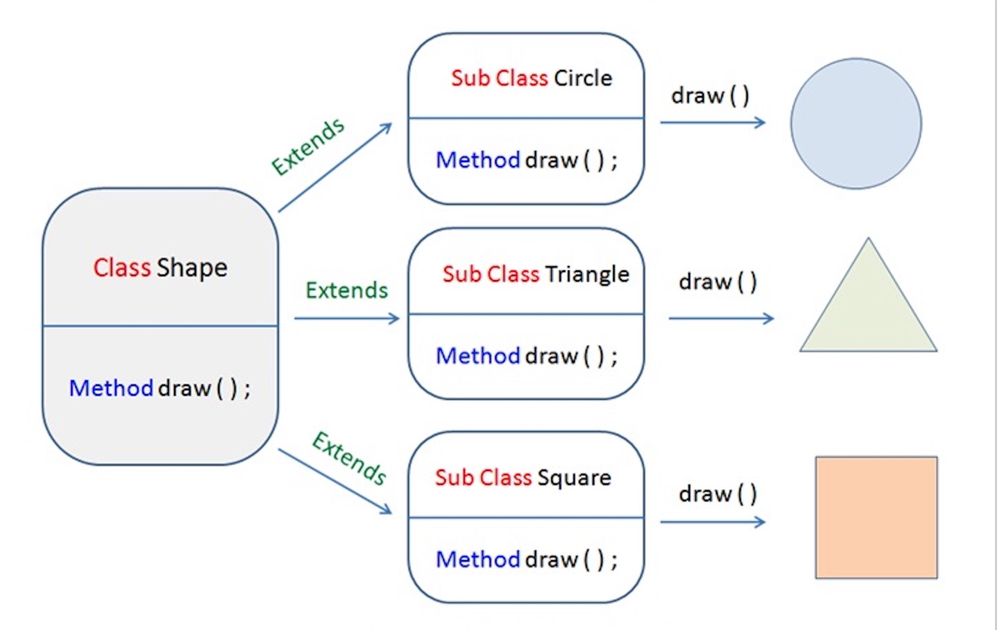

# 继承
## extends&implements
implements：可以变相的多继承。
## super&this
super：引用父类。
## 构造器
子类不继承构造器只是调用，如果有参数需要super调用。
``` Java
class SuperClass {
  private int n;
  SuperClass(){
    System.out.println("SuperClass()");
  }
  SuperClass(int n) {
    System.out.println("SuperClass(int n)");
    this.n = n;
  }
}
// SubClass 类继承
class SubClass extends SuperClass{
  private int n;
  
  SubClass(){ // 自动调用父类的无参数构造器
    System.out.println("SubClass");
  }  
  
  public SubClass(int n){ 
    super(300);  // 调用父类中带有参数的构造器
    System.out.println("SubClass(int n):"+n);
    this.n = n;
  }
}
// SubClass2 类继承
class SubClass2 extends SuperClass{
  private int n;
  
  SubClass2(){
    super(300);  // 调用父类中带有参数的构造器
    System.out.println("SubClass2");
  }  
  
  public SubClass2(int n){ // 自动调用父类的无参数构造器
    System.out.println("SubClass2(int n):"+n);
    this.n = n;
  }
}
public class TestSuperSub{
  public static void main (String args[]){
    System.out.println("------SubClass 类继承------");
    SubClass sc1 = new SubClass();
    SubClass sc2 = new SubClass(100); 
    System.out.println("------SubClass2 类继承------");
    SubClass2 sc3 = new SubClass2();
    SubClass2 sc4 = new SubClass2(200); 
  }
}
```
输出结果：
>------SubClass 类继承------
SuperClass()
SubClass
SuperClass(int n)
SubClass(int n):100
------SubClass2 类继承------
SuperClass(int n)
SubClass2
SuperClass()
SubClass2(int n):200

# Override&Overload

## Override
外壳不变，核心重写。
## Overload
方法名字相同，参数不同

# 多态
同一个接口，使用不同实例执行不同操作

``` java
class Shape {
    void draw() {}; 
}
class Circle extends Shape {
    void draw() {
        System.out.println("Circle.draw()")
    }
}
class Triangle extends Shape {
    void draw() {
        System.out.println("triangle.draw()")
    }
}
class Square extends Shape {
    void draw() {
        System.out.println("Square.draw()")
    }
}
```

## 实现方式
* 重写
* 接口
* 抽象类和抽象方法

# 抽象类
不能实例化对象，只能由子类调用。

# 封装
一般设置为私有

# 接口(Interface)
## 抽象类和接口的区别
1. 抽象类中的方法可以有方法体，就是能实现方法的具体功能，但是接口中的方法不行。
2. 抽象类中的成员变量可以是各种类型的，而接口中的成员变量只能是 public static final 类型的。
3. 接口中不能含有静态代码块以及静态方法(用 static 修饰的方法)，而抽象类是可以有静态代码块和静态方法。
4. 一个类只能继承一个抽象类，而一个类却可以实现多个接口。

**注**：JDK 1.8 以后，接口里可以有静态方法和方法体了。

**注**：JDK 1.8 以后，接口允许包含具体实现的方法，该方法称为"默认方法"，默认方法使用 default 关键字修饰。更多内容可参考 Java 8 默认方法。

**注**：JDK 1.9 以后，允许将方法定义为 private，使得某些复用的代码不会把方法暴露出去。更多内容可参考 Java 9 私有接口方法。11

## 写接口的方法
``` java
[可见度] interface 接口名称 [extends 其他的接口名] {
        // 声明变量
        // 抽象方法
}


/* 文件名 : NameOfInterface.java */
import java.lang.*;
//引入包
 
public interface NameOfInterface
{
   //任何类型 final, static 字段
   //抽象方法
}
```

## 接口的实现
... implements 接口名称[,其他接口名称,...]...
public class MammalInt implements Animal {}

# 枚举
是一个特殊的类，可以声明在类的内部
``` java
enum Color {
    RED,GREEN,BLUE;
}

public class Test
{
    // 执行输出结果
    public static void main(String[] args)
    {
        Color c1 = Color.RED;
        System.out.println(c1);
    }
}
```
>结果为：RED