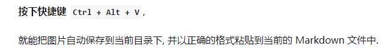

# Markdown
## 列表
* 无序列表
  * 嵌套无序列表
  * 嵌套无序列表
* 无序列表
* 无序列表

1. 有序列表 1
   1. 嵌套有序列表 1
   2. 嵌套有序列表 2
2. 有序列表 2
3. 有序列表 3
   
## 引用文本:

> 引用别人说的话
> 就这样写
> By. OrangeX4

这是 `行内代码` 语法.

代码块语法:

``` python
print("Hello, World!")
```
代码行数的显示: {.line-numbers}

``` javascript {.line-numbers}
function add(x, y) {
  return x + y
}
```
## 剪贴板图片插入
快捷键 Ctrl + Alt + V

## 表格
普通表格
| 表头 | 表头 |
| ---- | ---- |
| 内容 | 内容 |
| 内容 | 内容 |
Markdown Preview Enhanced 拓展功能:
| 表头 | 表头 |
| ---- | ---- |
| 内容 | 内容 |
| >    | 内容 |

| 表头 | 表头 |
| ---- | ---- |
| 内容 | 内容 |
| ^    | 内容 |